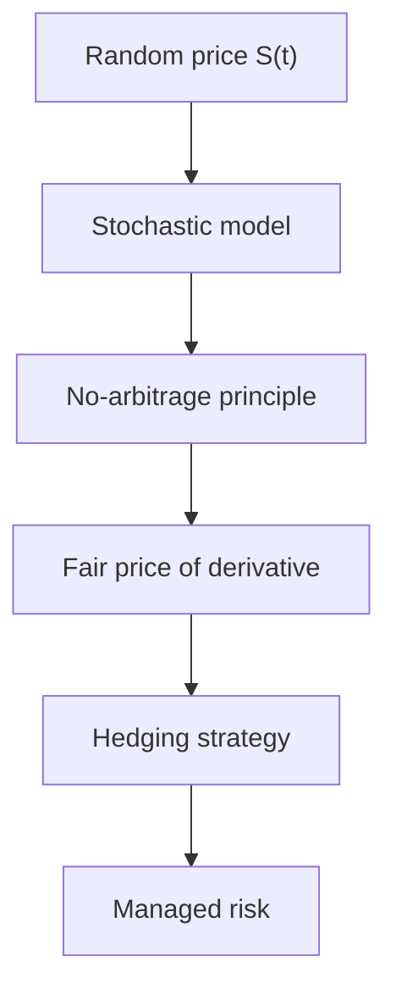
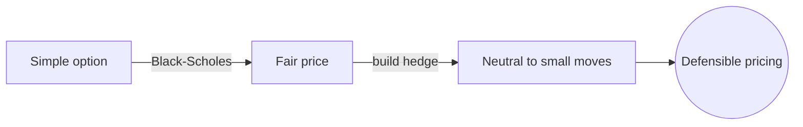

# Mathematical Finance

## Overview

Mathematical finance uses probability and calculus to model markets where prices move randomly. Its central problems are pricing assets fairly, hedging away risk, and building portfolios that balance return against uncertainty. Because prices are random, the tools come from probability theory and stochastic processes rather than ordinary deterministic math.

It matters because trillions of dollars flow through markets that need consistent pricing and risk control. The breakthrough idea is arbitrage-free pricing. If two portfolios always pay the same, they must cost the same, or someone earns free money. From this simple no-free-lunch principle comes the machinery, including the Black-Scholes model, that prices options. The tension is that models assume clean statistical behavior, while real markets have crashes, jumps, and fat tails that break those assumptions.

### Quick Takeaways

- Prices move randomly, so the math is built on probability and stochastic processes
- No-arbitrage pricing says identical payoffs must carry identical prices
- Models assume tidy statistics, but real markets have crashes and fat tails

## Definition

- **Derivative** is a contract whose value depends on an underlying asset's price.
- **Arbitrage** is a risk-free profit from price differences, which efficient markets erase.
- **Volatility** is the size of random price fluctuations, the key measure of risk.
- **Hedging** is offsetting risk by taking a position that moves opposite to another.
- **Brownian motion** is the continuous random walk used to model price movement.
- **Black-Scholes model** is the classic formula pricing options under stated assumptions.

## The Analogy

Pricing a derivative is like pricing an insurance policy on a house. You cannot know if the house will burn, but you can estimate the odds and the payout, then charge a fair premium. Mathematical finance does this for market risks. It uses the probability of price moves to compute a fair price for a contract whose payoff depends on those uncertain moves.

## When You See It

- Banks pricing stock options with the Black-Scholes formula
- Traders hedging a portfolio so it is neutral to small market moves
- Firms measuring potential loss with value-at-risk models
- Pension funds building portfolios that balance expected return and volatility
- Insurers pricing products whose payouts depend on market outcomes
- Regulators stress-testing banks against extreme market scenarios

## Examples

**Good:** Using Black-Scholes to price a simple option and building a hedge that neutralizes small price moves. Under normal conditions the model gives a consistent, defensible price.

**Bad:** Trusting a model that assumes normally distributed returns to size positions right before a crash. Real returns have fat tails, so the model badly understates the chance of a huge loss.

## Important Points

- No-arbitrage is the foundation, since free money cannot persist in efficient markets
- Prices are modeled as stochastic processes, usually built on Brownian motion
- Volatility is the central input, and estimating it wrong distorts every price
- Hedging turns a risky position into a nearly riskless one, at least for small moves
- The Black-Scholes assumptions, like constant volatility, fail in real crises
- Fat tails and jumps mean extreme events are far likelier than normal models say
- Risk measures like value-at-risk summarize exposure but can hide tail danger

## Summary

- Mathematical finance models random prices to value assets and manage risk.
- No-arbitrage pricing forces identical payoffs to have identical prices.
- Stochastic processes and volatility are the core modeling ingredients.
- Hedging offsets risk, and portfolio theory balances return against volatility.
- Standard models understate extreme events, which real markets deliver often.
- _The math prices the everyday well, but the rare disaster is where it strains._
