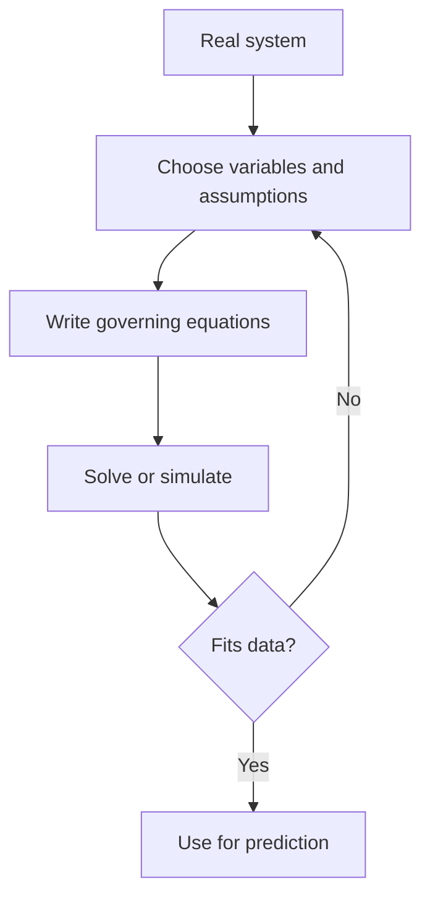
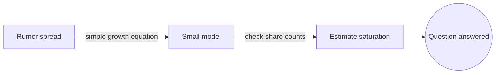

# Mathematical Modeling

## Overview

Mathematical modeling is the craft of representing a real system with mathematical objects like equations, functions, or rules. You decide which parts of the system matter, choose variables to stand for them, and write down relationships that capture the behavior. The model becomes a compact, manipulable stand-in for reality that you can study without touching the real thing.

It matters because models let you predict, explain, and control systems that are too costly, slow, or dangerous to experiment on directly. The central tension is abstraction. A model that keeps everything is as hard to use as reality itself, while a model that drops too much becomes wrong. Good modeling finds the smallest description that still answers your question.

### Quick Takeaways

- A model keeps only the features that matter for the question you are asking
- Every model rests on assumptions, and stating them clearly is part of the job
- Models are validated against data, then refined in a loop until they are useful

## Definition

- **Model** is a mathematical description that stands in for a real system.
- **Variable** is a quantity in the model that can change, like time or temperature.
- **Parameter** is a fixed value that tunes the model, estimated from data or theory.
- **Assumption** is a simplification that makes the model tractable but limits its range.
- **Deterministic model** produces the same output for the same input every time.
- **Stochastic model** includes randomness, so outputs are distributions not single values.

## The Analogy

A subway map is a model of a city's transit. It throws away real distances, street angles, and geography, keeping only which stations connect to which lines. That distortion is the point. For the question "how do I get from here to there," the simplified map beats a satellite photo. A good mathematical model is the same, a deliberate distortion tuned to one purpose.

## When You See It

- Epidemiologists writing SIR equations to project how an outbreak grows
- Engineers modeling a structure with stress and strain equations before building
- Climate scientists coupling ocean and atmosphere equations on a global grid
- Economists modeling supply and demand to study how a policy shifts prices
- Ecologists using predator-prey equations to study population swings
- Physicists reducing a messy setup to a clean idealized system to reason about it

## Examples

**Good:** Modeling a spreading rumor with a simple growth equation, checking it against real share counts, and using it to estimate when saturation hits. The model is small, testable, and answers the question.

**Bad:** Building a hundred-parameter model of a market and tuning it until it fits past data perfectly. It memorizes history and fails on anything new, a case of fitting noise instead of structure.

## Important Points

- The first modeling decision is what to leave out, since detail is not free
- Assumptions define the model's valid range, and using it outside that range is misuse
- Parameters must be estimated from data, and bad estimates sink a good structure
- Dimensional analysis catches errors early by checking units on every term
- Simple models that you understand often beat complex models that you cannot
- A model that fits training data perfectly may generalize poorly, a sign of overfitting
- Modeling is iterative, you build, test, learn where it breaks, and rebuild

## Summary

- Mathematical modeling turns a real system into equations you can analyze and simulate.
- Good models keep only what matters for the specific question at hand.
- Assumptions set the boundaries of where a model can be trusted.
- Validation against real data is what makes a model more than a guess.
- The process loops, refining structure and parameters until the model is useful.
- _A model is a useful lie, distorted on purpose to answer one honest question._
