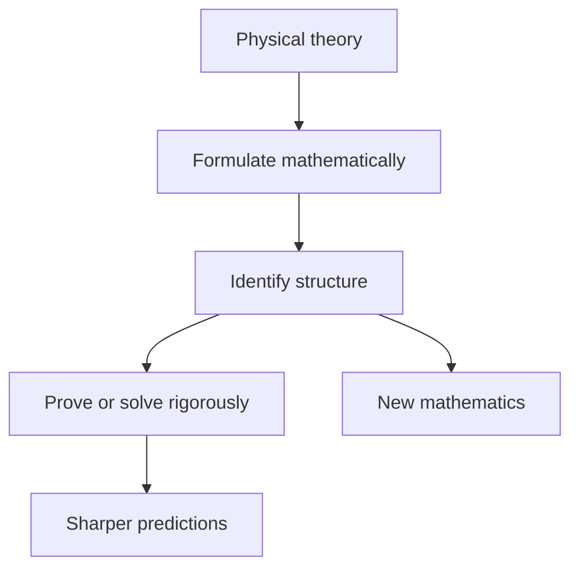

# Mathematical Physics

## Overview

Mathematical physics is the part of the field that builds and sharpens the mathematics physics needs. Physicists often reach for tools that work before anyone proves why. Mathematical physicists put those tools on firm ground, give them precise definitions, and sometimes discover the theory was hiding richer structure than the physics first suggested.

It matters because physics is written in mathematics, and shaky foundations lead to wrong conclusions. Quantum mechanics needed the theory of operators on Hilbert spaces. General relativity needed differential geometry. The tension is between physical intuition, which races ahead, and mathematical rigor, which insists on proof. Both are needed, and the best work marries them.

### Quick Takeaways

- It supplies the rigorous math that physical theories rest on
- Physical intuition often leads, and rigor follows to justify and refine it
- Whole areas of math grew from questions physics raised

## Definition

- **Mathematical physics** is the rigorous mathematical treatment of physical theories.
- **Differential equation** is an equation relating a function to its rates of change.
- **Hilbert space** is a complete inner-product space, the setting for quantum states.
- **Symmetry group** is the set of transformations that leave a system's laws unchanged.
- **Field theory** describes quantities defined at every point in space and time.
- **Boundary condition** is a constraint the solution must satisfy at the edges of the domain.

## The Analogy

Think of physicists as explorers who find a fast river route through a jungle and start ferrying cargo across it. Mathematical physicists are the engineers who come after, survey the banks, prove the crossing is safe in all seasons, and sometimes find a deeper channel nobody noticed. The explorers move first, but the engineers make the route dependable.

## When You See It

- Formulating quantum mechanics with self-adjoint operators on Hilbert spaces
- Using differential geometry to express general relativity's curved spacetime
- Applying group theory to classify particles by their symmetries
- Solving the heat and wave equations with Fourier series and transforms
- Proving that a physical model's equations actually have a solution
- Studying integrable systems where exact solutions exist against the odds

## Examples

**Good:** Recasting quantum mechanics in the language of Hilbert spaces and self-adjoint operators, which explains why observables have real values and gives the theory a solid base.

**Bad:** Manipulating divergent integrals in a calculation without any regularization or justification, then trusting the finite-looking number that falls out. The math is undefined and the result is unreliable.

## Important Points

- Physics often uses math heuristically, and rigor is added later to justify it
- Symmetry is a organizing principle, since conserved quantities follow from symmetries
- Many physical laws are partial differential equations tied to space and time
- The same equation can model heat, diffusion, and quantum probability spreading
- Exact solutions are rare, so approximation and perturbation methods dominate
- Ill-posed problems, where solutions do not exist or blow up, signal a modeling flaw
- New mathematics like operator theory and gauge theory grew directly from physics

## Summary

- Mathematical physics gives physical theories their rigorous mathematical foundation.
- Physical intuition usually leads, and mathematical proof follows to secure it.
- Core tools include differential equations, Hilbert spaces, and symmetry groups.
- Exact solutions are scarce, so approximation methods carry much of the work.
- Physics has repeatedly driven the creation of entirely new areas of mathematics.
- _Intuition finds the path, and rigor proves the bridge will hold._
