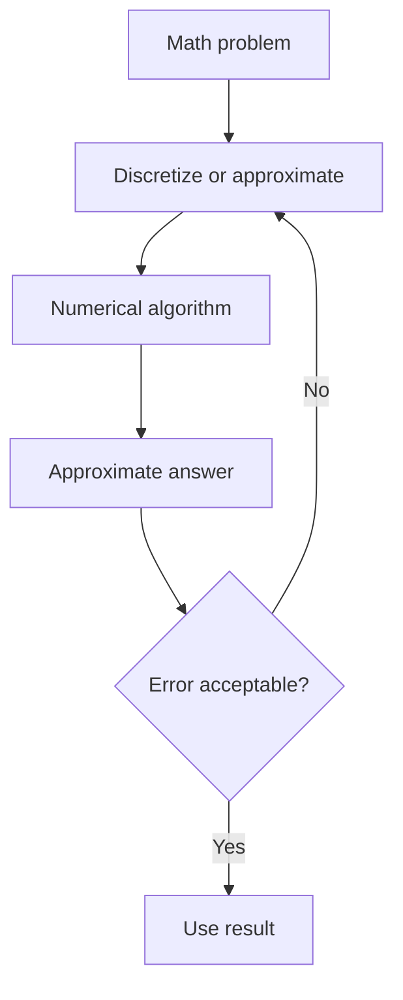
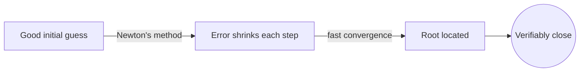
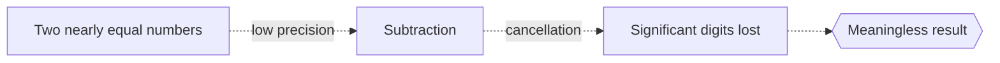

# Numerical Analysis

## Overview

Numerical analysis designs algorithms that solve mathematical problems approximately using arithmetic a computer can actually perform. Most real equations have no exact closed-form solution, and even when they do, computers work with finite precision. This field builds methods that produce answers close enough to be useful, along with guarantees about how close.

It matters because it is the engine under every simulation, from weather to spacecraft to graphics. The two constant concerns are error and stability. Every approximation introduces error, and rounding in finite-precision arithmetic can accumulate. A stable algorithm keeps errors from exploding, while an unstable one can turn a tiny rounding slip into a wildly wrong answer. Managing that trade-off between speed, accuracy, and stability is the whole craft.

### Quick Takeaways

- It finds approximate answers when exact ones are impossible or impractical
- Every method has error, and controlling it is the central concern
- Stability keeps small rounding errors from blowing up into large ones

## Definition

- **Approximation** is a computable answer close to the true solution.
- **Truncation error** is error from replacing an exact process with a finite one.
- **Rounding error** is error from representing numbers with finite precision.
- **Convergence** is how the approximation approaches the true answer as work increases.
- **Stability** is the property that small input or rounding errors stay small.
- **Iteration** is repeating a step to refine an estimate toward the solution.

## The Analogy

Measuring a coastline with a ruler is numerical analysis in spirit. You can never trace every grain of sand, so you approximate with straight segments. Shorter segments give a better estimate but take more work. Numerical methods make the same bargain, trading more computation for less error, always aware that the measurement is never exact.

## When You See It

- Solving differential equations that model physics with no closed-form solution
- Root-finding methods like Newton's method locating where a function is zero
- Integrating a function numerically when no antiderivative exists
- Solving huge linear systems that arise in simulations and graphics
- Interpolating and fitting curves through scattered data points
- Training models where gradients are computed and applied approximately

## Examples

**Good:** Using Newton's method with a good initial guess to find a root quickly, checking that each step reduces the error. Convergence is fast and the answer is verifiably close.

**Bad:** Subtracting two nearly equal large numbers to get a small difference in low precision. Catastrophic cancellation wipes out significant digits, leaving a meaningless result.

## Important Points

- Total error combines truncation from the method and rounding from the hardware
- Stability matters more than raw accuracy, since instability makes any answer useless
- Convergence rate tells you how fast error shrinks as you do more work
- Well-conditioned problems tolerate input error, ill-conditioned ones amplify it
- Iterative methods refine a guess, and knowing when to stop is part of the design
- Choosing the right method depends on problem size, structure, and precision needed
- Verification against known cases guards against silent numerical bugs

## Summary

- Numerical analysis builds algorithms for approximate, computable solutions.
- It exists because exact solutions are rare and precision is finite.
- Error and stability are the two constant concerns in every method.
- Convergence describes how fast the approximation nears the truth.
- The craft balances speed, accuracy, and stability for each problem.
- _The answer is never exact, so the art is making the error small and controlled._
