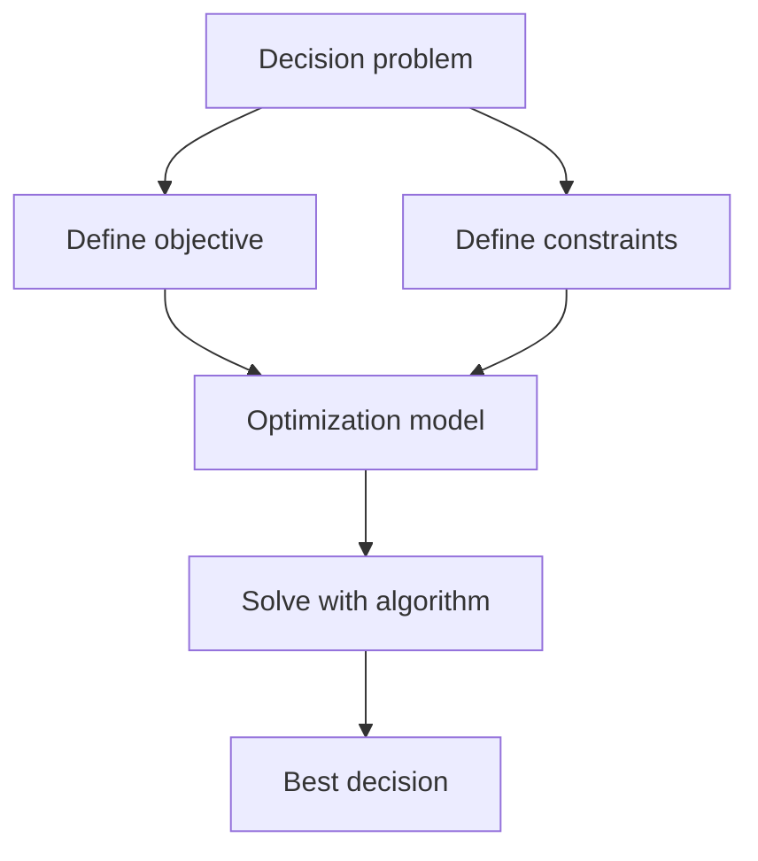
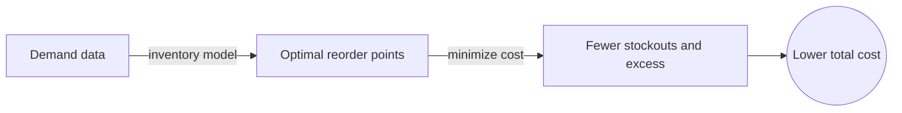
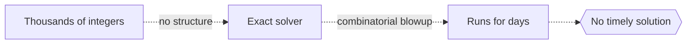

# Operations Research

## Overview

Operations research applies mathematical modeling to decision problems. You have limited resources, competing goals, and many possible choices. It builds a model of the situation, defines what "best" means, and uses algorithms to find the choice that scores best. The field grew out of wartime logistics and now runs supply chains, airlines, hospitals, and factories.

It matters because organizations constantly face decisions too complex for gut feeling. How many trucks, which routes, what inventory, when to schedule. These involve millions of combinations that no human can weigh by hand. The tension is between building a model faithful enough to trust and simple enough to solve at scale. A perfect model you cannot compute helps no one.

### Quick Takeaways

- It turns a messy decision into a model with an objective and constraints
- Algorithms then search the huge space of options for the best one
- The payoff is measurable, like lower cost or higher throughput

## Definition

- **Objective function** is the quantity you want to maximize or minimize, like profit or cost.
- **Constraint** is a limit the solution must respect, like budget or capacity.
- **Decision variable** is a quantity you control, like how many units to produce.
- **Feasible region** is the set of all choices that satisfy every constraint.
- **Linear programming** optimizes a linear objective under linear constraints.
- **Integer programming** requires some variables to be whole numbers, like counts of trucks.

## The Analogy

Think of planning a road trip with a fixed budget, a set of cities you want to visit, and a limited number of days. You want the most enjoyable trip, but gas, hotel, and time all constrain you. Operations research is the systematic way to weigh every routing against those limits and pick the itinerary that maximizes value, instead of guessing and hoping.

## When You See It

- Airlines scheduling crews and aircraft to cover flights at least cost
- Warehouses deciding stock levels to balance holding cost against stockouts
- Delivery companies routing fleets to minimize total distance driven
- Hospitals scheduling staff and operating rooms to meet demand
- Factories sequencing jobs on machines to finish orders on time
- Utilities dispatching power plants to meet load at minimum cost

## Examples

**Good:** A retailer models inventory with demand data and solves for reorder points that minimize expected cost. The model cuts both stockouts and excess stock at once.

**Bad:** Modeling a scheduling problem with thousands of integer variables and no structure, then expecting an exact solver to finish quickly. It may run for days, since integer problems can explode in difficulty.

## Important Points

- The three ingredients are always an objective, decision variables, and constraints
- Linear programs are solved fast and reliably, even with millions of variables
- Integer constraints make problems far harder, sometimes intractable at scale
- When exact solutions are too slow, heuristics find good-enough answers quickly
- Sensitivity analysis shows how the best decision shifts if inputs change
- A model is only as good as its data, so estimates of cost and demand matter
- Simulation complements optimization when randomness makes closed-form models hard

## Summary

- Operations research models decisions as objectives, variables, and constraints.
- Algorithms then find the choice that optimizes the objective within the limits.
- Linear programming is fast, while integer programming can be very hard.
- Heuristics deliver good solutions when exact methods are too slow.
- The value is concrete, measured in saved cost and improved throughput.
- _Turn a hard decision into a model, then let the algorithm find the best move._
