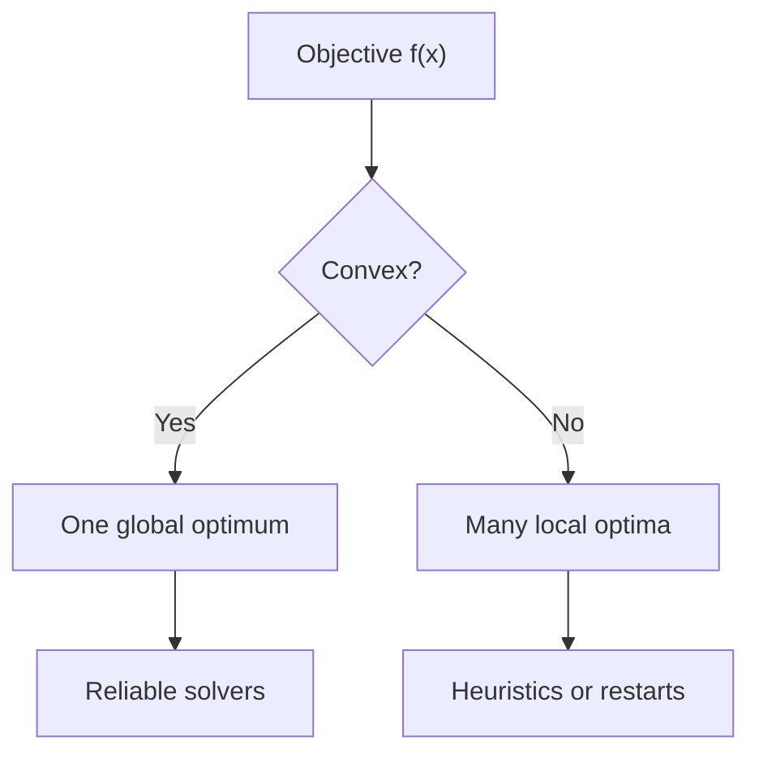

# Optimization

## Overview

Optimization is the search for the best choice from a set of options. You have an objective function that scores each option, and you want the input that gives the highest or lowest score. Often you also have constraints that rule out some options. The whole field is about finding that best point efficiently, even when the space of options is enormous.

It matters because "find the best" underlies training machine learning models, designing structures, allocating money, and countless other tasks. The single biggest divide is convex versus non-convex. Convex problems have one bowl-shaped minimum you can always reach, while non-convex problems have many valleys where you can get stuck. Knowing which kind you face shapes every method you use.

### Quick Takeaways

- You minimize or maximize an objective function over allowed inputs
- Constraints shrink the set of valid options to a feasible region
- Convex problems have one true optimum, non-convex ones have many traps

## Definition

- **Objective function** is the quantity being minimized or maximized.
- **Feasible region** is the set of inputs that satisfy all constraints.
- **Global optimum** is the best value over the entire feasible region.
- **Local optimum** is the best value only within some neighborhood.
- **Convex function** curves upward everywhere, so any local minimum is global.
- **Gradient** is the vector of partial derivatives pointing toward steepest increase.

## The Analogy

Finding an optimum is like hiking to the lowest point of a landscape in fog. In a convex landscape shaped like a single smooth bowl, walking downhill always leads to the one true bottom. In a rugged landscape of many valleys, walking downhill lands you in whatever valley you started near, which may not be the deepest one anywhere.

## When You See It

- Training a machine learning model by minimizing its loss function
- Designing a bridge to minimize material while meeting strength limits
- Building an investment portfolio that maximizes return for a risk level
- Fitting a curve to data by minimizing squared error
- Routing and scheduling problems that minimize time or cost
- Tuning any system where you have knobs and a measure of quality

## Examples

**Good:** Framing a least-squares curve fit as a convex problem and solving it with a standard method. Convexity guarantees the solution found is the true best fit.

**Bad:** Running plain gradient descent once on a highly non-convex neural loss and assuming the result is the global best. It found one local minimum, and others could be far better.

## Important Points

- Convexity is the dividing line, since convex problems solve reliably to the global best
- The gradient points uphill, so descent methods move against it to minimize
- Constraints are handled with Lagrange multipliers or projection onto the feasible set
- Non-convex problems use random restarts, momentum, or heuristics to escape traps
- First-order methods use gradients, second-order methods use curvature for faster steps
- No free lunch means no single optimizer wins on every problem
- Well-posed objectives and good starting points matter as much as the algorithm

## Summary

- Optimization finds the input that best scores an objective under constraints.
- Convex problems have a single global optimum reachable by descent.
- Non-convex problems have many local optima that can trap simple methods.
- Gradients guide descent, and constraints reshape the feasible region.
- The right method depends heavily on the structure of the problem.
- _Downhill always works in a bowl, but the world is rarely just one bowl._
