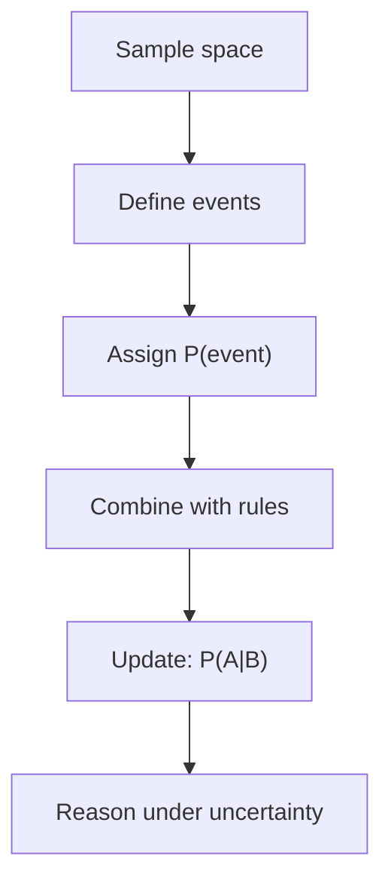

# Probability Theory

## Overview

Probability theory is the mathematics of uncertainty. It assigns numbers between zero and one to events, capturing how likely each one is. From a few simple axioms, it builds a complete system for combining chances, updating beliefs when new information arrives, and predicting the long-run behavior of random processes.

It matters because uncertainty is unavoidable, and probability is the only rigorous language for it. It underpins statistics, machine learning, physics, and finance. The subtle part is conditional probability, how the chance of one event shifts once you know another has happened. Getting this right is the difference between sound reasoning and classic fallacies, since people's intuition about combining and updating probabilities is famously unreliable.

### Quick Takeaways

- Probability assigns each event a number from zero to one measuring its likelihood
- A handful of axioms generate the entire consistent framework
- Conditional probability, updating on new information, is where intuition often fails

## Definition

- **Sample space** is the set of all possible outcomes of an experiment.
- **Event** is a subset of the sample space, a collection of outcomes.
- **Probability** is a number from zero to one measuring an event's likelihood.
- **Conditional probability** is the chance of one event given another has occurred.
- **Independence** means one event's occurrence does not change another's probability.
- **Random variable** is a function assigning a number to each outcome.

## The Analogy

Think of probability as a fixed budget of one unit of belief that you spread across all possible outcomes. A fair coin splits the budget evenly, half on heads and half on tails. Learning new information, like the coin landed on an edge sensor, forces you to redistribute the budget, moving belief onto the outcomes still possible. That redistribution is conditional probability.

## When You See It

- Estimating the risk of failure in an engineered system
- Machine learning models outputting a probability for each class
- Insurers pricing policies from the probability of claims
- Medical tests interpreted by combining accuracy with base rates
- Games of chance and gambling odds computed exactly
- Weather forecasts giving a percent chance of rain

## Examples

**Good:** Using Bayes' rule to combine a test's accuracy with a disease's base rate, correctly finding that a positive result on a rare disease is often a false alarm.

**Bad:** Assuming a positive test on a rare disease means the person almost certainly has it. Ignoring the low base rate leads to a wildly overconfident and wrong conclusion.

## Important Points

- The whole framework rests on three axioms, yet generates enormous structure
- Conditional probability is where most reasoning errors creep in
- Bayes' rule is the correct machinery for updating beliefs on new evidence
- Independence is a strong assumption that is often wrongly taken for granted
- The law of large numbers says sample averages converge to true probabilities
- The central limit theorem explains why sums of randomness look bell-shaped
- Base rates matter enormously, and ignoring them causes the base rate fallacy

## Summary

- Probability theory quantifies uncertainty with numbers between zero and one.
- A few axioms build the entire consistent framework for random events.
- Conditional probability and Bayes' rule govern updating on new information.
- Human intuition about combining probabilities is unreliable, so rules matter.
- Key theorems explain convergence of averages and the ubiquity of the bell curve.
- _Spread your belief across the outcomes, then move it as evidence arrives._
