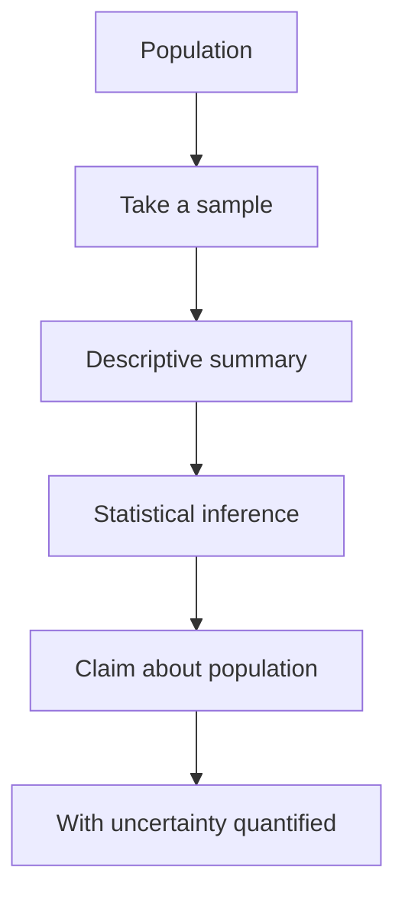

# Statistics

## Overview

Statistics is the discipline of learning from data. You gather observations, summarize them, and then reason about what they tell you about a larger world you cannot fully observe. The core challenge is uncertainty. Your data is a limited, noisy sample, and statistics gives principled ways to say what you can and cannot conclude from it.

It matters because nearly every field, from medicine to marketing, decides based on data. The heart of the subject is inference, using a sample to make claims about a population, with an honest measure of how confident you can be. The tension is between signal and noise. Random variation can look like a real pattern, so statistics builds tools to tell a genuine effect from a lucky coincidence.

### Quick Takeaways

- It turns a limited, noisy sample into claims about a larger population
- Every conclusion comes with a measure of uncertainty, not false certainty
- The central skill is separating a real signal from random noise

## Definition

- **Population** is the entire group you want to draw conclusions about.
- **Sample** is the subset of the population you actually observe.
- **Parameter** is a fixed but unknown number describing the population.
- **Statistic** is a number computed from the sample to estimate a parameter.
- **Confidence interval** is a range likely to contain the true parameter.
- **p-value** is the chance of seeing data this extreme if there were no real effect.

## The Analogy

Imagine tasting a spoonful of soup to judge the whole pot. You do not drink it all, you trust that one well-stirred spoonful represents the rest. Statistics formalizes this. The spoonful is your sample, the pot is the population, and the whole art is knowing how much to trust the spoonful and when the pot was not stirred well enough.

## When You See It

- Clinical trials testing whether a new drug beats a placebo
- Polls estimating an election result from a few thousand respondents
- A/B tests deciding which website version converts better
- Quality control sampling products to catch defects on a line
- Studies estimating the effect of a policy from observed outcomes
- Any dashboard reporting an average with a margin of error

## Examples

**Good:** Running a randomized trial, reporting the effect size with a confidence interval, and stating the sample size. Readers can judge both the effect and how solid the evidence is.

**Bad:** Testing twenty hypotheses and trumpeting the one with a low p-value as a discovery. With that many tests, a false positive is expected by chance, so the finding is likely noise.

## Important Points

- A sample only supports conclusions if it truly represents the population
- Correlation is not causation, since a link can arise from a hidden common cause
- p-values measure surprise under a null hypothesis, not the truth of a claim
- Confidence intervals convey uncertainty better than a single point estimate
- Larger samples shrink random error but do not fix a biased sampling method
- Multiple comparisons inflate false positives unless you correct for them
- Descriptive statistics summarize data, inferential statistics generalize from it

## Summary

- Statistics draws reliable conclusions from limited, noisy data.
- Inference uses a sample to make claims about the wider population.
- Every conclusion carries an honest measure of uncertainty.
- The central task is telling a real signal apart from random noise.
- Sampling method, sample size, and multiple testing all shape validity.
- _Trust the spoonful only as far as the stirring and the tasting allow._
