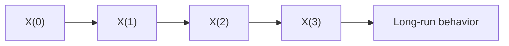

# Stochastic Processes

## Overview

A stochastic process is a collection of random variables indexed by time. Where a single random variable captures one uncertain quantity, a stochastic process captures how uncertainty unfolds step after step. It models any system whose future is random but influenced by its present, like a stock price, a queue, or a particle jittering in a fluid.

It matters because most real random phenomena are not one-shot events, they are ongoing processes. The key questions are about behavior over time, such as where the process tends to go, how fast it spreads, and whether it settles. The central tension is dependence. Steps may be independent, or the past may shape the future, and the whole difficulty of the subject lies in modeling that dependence correctly.

### Quick Takeaways

- It is a sequence of random variables that describes randomness evolving in time
- The key is dependence, how much the past shapes the future
- Questions focus on long-run behavior, spread, and whether the process settles

## Definition

- **Stochastic process** is a family of random variables indexed by time.
- **Index set** is the set of times, either discrete steps or continuous.
- **State space** is the set of values the process can take.
- **Increment** is the change in the process between two times.
- **Markov process** is one where the future depends only on the present state.
- **Stationarity** is when the process's statistical properties do not change over time.

## The Analogy

Picture a drunkard walking home, taking one random step left or right each moment. A single step is a random variable. The whole wandering journey, tracked over time, is a stochastic process. You cannot predict any single step, but you can say useful things about the walk overall, like how far from the start he probably ends up after many steps.

## When You See It

- Modeling stock prices as random walks or geometric Brownian motion
- Queueing theory tracking how customer lines grow and shrink randomly
- Physics describing Brownian motion of particles suspended in fluid
- Inventory systems where demand arrives at random times
- Reliability models tracking random failures of components over time
- Signal processing separating a random signal from random noise

## Examples

**Good:** Modeling arrivals at a call center as a Poisson process to predict staffing needs. The random-arrival model matches reality and gives actionable staffing numbers.

**Bad:** Modeling a strongly trending, autocorrelated series as independent increments. Treating dependent steps as independent throws away the very structure that drives the series.

## Important Points

- The index set can be discrete steps or continuous time, changing the tools used
- The Markov property, future depends only on present, greatly simplifies analysis
- Brownian motion is the continuous-time building block for many models
- The Poisson process models random arrivals with a constant average rate
- Stationarity lets you assume the statistics hold steady, easing estimation
- A random walk can wander forever or return to its start, depending on dimension
- Increments may be independent or correlated, and this choice defines the model

## Summary

- A stochastic process models randomness unfolding across time.
- It is a sequence of random variables tied together by an index of time.
- Dependence structure, especially the Markov property, drives the analysis.
- Brownian motion and the Poisson process are core building blocks.
- The interest lies in long-run behavior, spread, and steady-state properties.
- _You cannot call the next step, but you can chart the shape of the whole journey._
