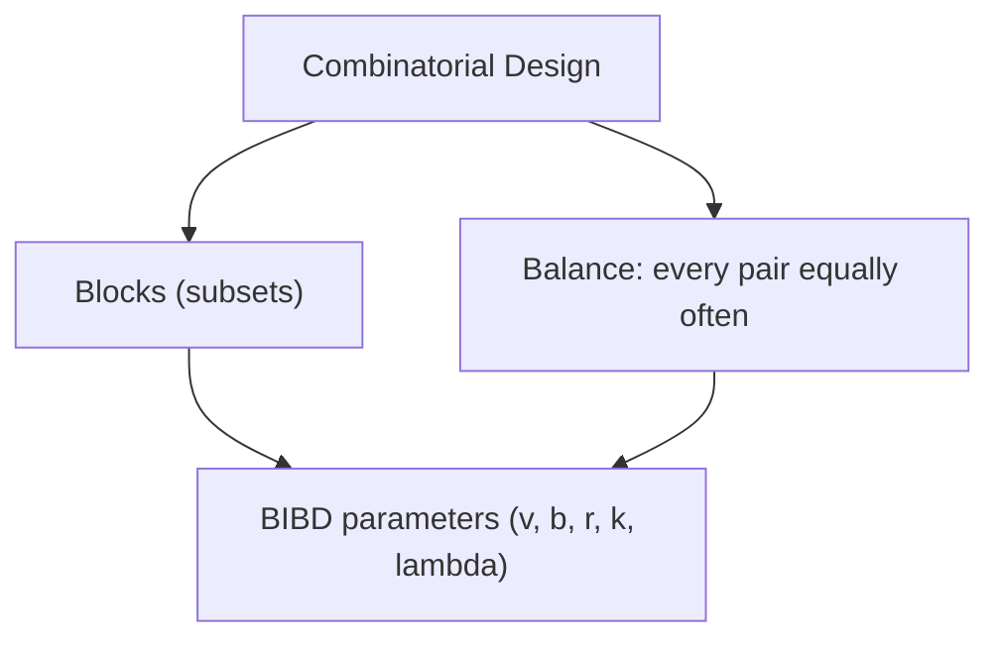
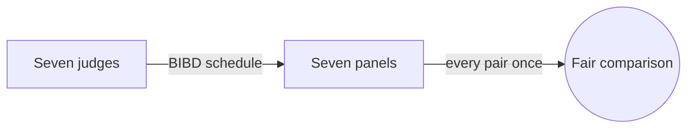

# Combinatorial Design

## Overview

Combinatorial design theory studies how to arrange elements into groups, called blocks, so that some balance condition holds exactly. The classic condition is that every pair of elements appears together in the same number of blocks. This uniformity is the whole point. Rather than any arrangement, you want one where no pair is favored and no pair is neglected. Achieving that with a small number of blocks is a delicate combinatorial puzzle governed by strict arithmetic constraints.

It matters because balanced arrangements make experiments fair and systems efficient. Statisticians use designs so that every treatment gets compared evenly, removing bias. The same balance shows up in scheduling tournaments, building error-correcting codes, and testing software configurations. The tension is existence. The counting conditions that a design must satisfy are necessary but not always sufficient, so knowing whether a given design exists at all can be hard.

### Quick Takeaways

- Designs arrange elements into blocks with an exact balance condition
- A balanced incomplete block design makes every pair co-occur equally often
- Existence is constrained by strict arithmetic divisibility conditions

## Definition

- **Block** is a subset of the element set chosen according to the design rules.
- **Balanced incomplete block design** requires every pair of elements to appear in exactly lambda blocks.
- **Parameters (v, b, r, k, lambda)** count elements, blocks, blocks per element, block size, and pair frequency.
- **Latin square** is an n by n grid where each symbol appears once per row and column.
- **Steiner system** is a design where every t-subset lies in exactly one block.
- **Resolvable design** partitions its blocks into parallel classes covering all elements.

## The Analogy

Imagine scheduling a round-robin tournament where every team must play every other team the same number of times, on balanced days. You cannot just throw matches together, or some pairs meet twice while others never do. You need a careful schedule where each pairing appears exactly as often as required. Combinatorial design is the mathematics of building such perfectly balanced schedules.

## When You See It

- Designing statistical experiments and clinical trials
- Scheduling sports tournaments and round-robins
- Building error-correcting codes from block structures
- Software testing with covering arrays for configurations
- Cryptographic key distribution schemes
- Constructing finite geometries and Latin squares

## Examples

**Good:** Using a balanced incomplete block design to schedule seven judges over seven panels so every pair of judges serves together exactly once. The balance guarantees fair comparison.

**Bad:** Assigning blocks by hand so some element pairs never meet while others meet three times. The arrangement is unbalanced and defeats the purpose of a design.

## Important Points

- The defining feature is exact balance, not merely a valid arrangement
- BIBD parameters must satisfy bk = vr and lambda(v-1) = r(k-1)
- Fisher's inequality states a BIBD needs at least as many blocks as elements
- Necessary counting conditions do not always guarantee a design exists
- Latin squares and mutually orthogonal Latin squares are key building blocks
- Steiner systems are designs where every t-subset appears exactly once
- Designs connect to finite projective planes and error-correcting codes
- Resolvable designs split into rounds, ideal for scheduling

## Summary

- Combinatorial design arranges elements into blocks with exact balance.
- A BIBD makes every pair of elements co-occur the same number of times.
- Parameters obey strict arithmetic constraints like bk = vr.
- Existence is subtle since counting conditions are necessary, not sufficient.
- Designs power experiments, scheduling, coding, and finite geometry.
- _Balance is the whole point: no pair favored, no pair forgotten._
