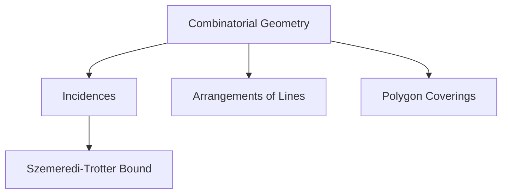
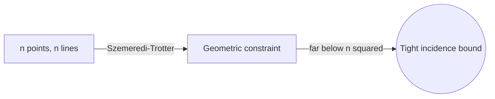

# Combinatorial Geometry

## Overview

Combinatorial geometry, also called discrete geometry, studies the combinatorial structure of geometric objects. Instead of measuring exact lengths and angles, it asks how many ways points, lines, circles, and polygons can meet, cross, or be arranged. Typical questions count incidences between points and lines, colorings of the plane, or the minimum number of pieces needed to cover a shape. The objects are geometric, but the answers are about counting and structure, so the flavor is discrete.

It matters because many computational and optimization problems reduce to geometric arrangements. Range searching, motion planning, and mesh generation all depend on how discrete geometric elements interact. The central tension is that geometry adds constraints pure combinatorics lacks. Points on a line cannot be arranged arbitrarily, and that extra structure makes some counts smaller and some proofs sharper than in abstract combinatorics.

### Quick Takeaways

- It counts arrangements and intersections of discrete geometric objects
- Incidence problems ask how often points and lines meet
- Geometry adds constraints that pure combinatorics does not have

## Definition

- **Incidence** is a point lying on a line or a similar containment relation.
- **Arrangement** is the subdivision of the plane created by a set of lines or curves.
- **Convex hull** is the smallest convex shape containing a set of points.
- **Triangulation** partitions a region into triangles with given vertices.
- **Chromatic number of the plane** asks how many colors avoid same-color points at unit distance.
- **Ham-sandwich theorem** guarantees a single cut that bisects several sets at once.

## The Analogy

Imagine scattering matchsticks and marbles on a table. You are not asking how long each matchstick is. You are asking how many marbles sit exactly on a matchstick, how many regions the matchsticks carve the table into, and how few colors let no two touching marbles share a color. Combinatorial geometry is that counting of contacts and regions among simple geometric pieces.

## When You See It

- Computational geometry algorithms for maps and graphics
- Range searching and nearest-neighbor queries
- Motion planning and robotics collision checks
- Mesh generation for simulation and rendering
- Facility location and coverage problems
- Extremal bounds on point-line incidences

## Examples

**Good:** Bounding the number of point-line incidences among n points and n lines using the Szemeredi-Trotter theorem. The geometric constraint yields a far smaller count than naive multiplication.

**Bad:** Assuming any bipartite incidence pattern between points and lines is realizable. Geometry forbids many patterns, so pure combinatorial counts overestimate what can actually occur.

## Important Points

- Geometric constraints make incidence counts smaller than abstract set counts
- The Szemeredi-Trotter theorem tightly bounds point-line incidences
- Arrangements of n lines create at most order n squared regions
- Convex position dramatically restricts how points can interact
- Helly's theorem links pairwise intersection to global intersection
- The ham-sandwich theorem gives simultaneous bisection results
- Many results give extremal bounds, the maximum or minimum possible
- Realizability is subtle: not every combinatorial pattern has a geometric model

## Summary

- Combinatorial geometry counts contacts, regions, and arrangements of geometric objects.
- Incidence problems between points and lines are a central theme.
- Geometric constraints sharpen counts compared to pure combinatorics.
- Key results include Szemeredi-Trotter, Helly, and the ham-sandwich theorem.
- It underpins computational geometry and optimization algorithms.
- _The question is not how long the lines are, but how often and where they meet._
