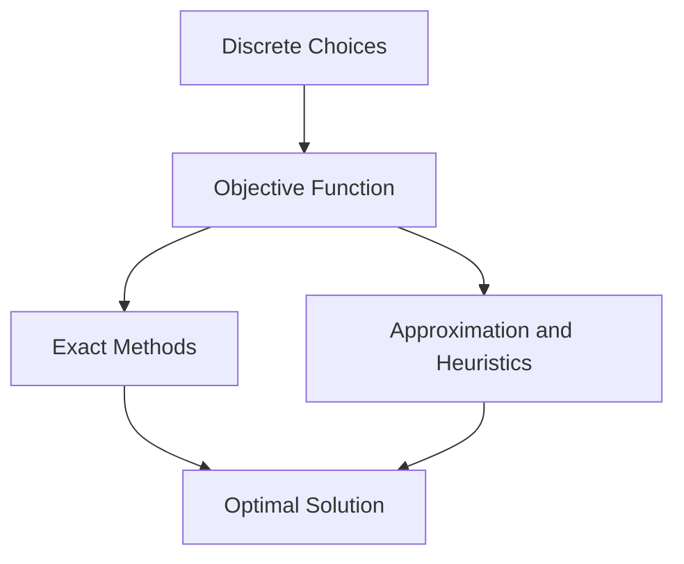

# Combinatorial Optimization

## Overview

Combinatorial optimization searches a finite set of discrete options for the best one. Each candidate is a combination, such as a route, a schedule, or an assignment, and an objective function scores it. The set of candidates is finite but usually astronomically large, so listing them all is impossible. The core idea is to exploit structure in the problem so you can find or approximate the optimum without checking every possibility.

It matters because scarce resources force choices everywhere, in logistics, networks, and manufacturing. The defining tension is that many of these problems are NP-hard, meaning no known algorithm solves them quickly in the worst case. So the field splits between exact methods that guarantee the optimum on tractable cases and approximation or heuristic methods that deliver good-enough answers fast when exactness is out of reach.

### Quick Takeaways

- It picks the best option from a finite but huge set of discrete choices
- Many core problems are NP-hard, so exact solving can be intractable
- The practical answer is often approximation or heuristics with guarantees

## Definition

- **Feasible solution** is a candidate that satisfies all the problem constraints.
- **Objective function** assigns a numeric cost or value to each solution.
- **Optimal solution** is the feasible solution with the best objective value.
- **NP-hard** describes problems for which no known polynomial-time exact algorithm exists.
- **Approximation algorithm** runs fast and guarantees a bounded distance from optimal.
- **Relaxation** loosens constraints, often to a continuous problem, to bound the optimum.

## The Analogy

Think of packing a suitcase for a trip with a strict weight limit. Every subset of your belongings is a candidate, and you want the most valuable combination that still fits. You cannot try every subset because there are too many, so you use rules of thumb and smart pruning. Combinatorial optimization is that packing problem generalized to routes, schedules, and networks.

## When You See It

- Vehicle routing and delivery logistics
- Job scheduling and resource allocation
- Network design and traffic routing
- Portfolio and knapsack selection problems
- Assignment and matching of workers to tasks
- Circuit layout and chip design

## Examples

**Good:** Modeling delivery routing as a traveling salesman problem and using a proven approximation to get a tour within a known factor of optimal. It is fast and quality-bounded.

**Bad:** Solving a 1,000-city traveling salesman instance by brute-force enumeration of all tours. The number of tours explodes factorially, so it never finishes.

## Important Points

- The search space is finite but typically grows exponentially or factorially
- Many flagship problems, like TSP and knapsack, are NP-hard
- Exact methods include branch and bound, cutting planes, and dynamic programming
- Linear programming relaxations give bounds and guide rounding
- Approximation algorithms trade optimality for speed with provable guarantees
- Some problems, like minimum spanning tree and matching, are solvable in polynomial time
- Heuristics like greedy and local search work well in practice without guarantees
- Problem structure, such as matroids, can make greedy methods optimal

## Summary

- Combinatorial optimization finds the best choice among finite discrete options.
- The candidate set is huge, so exhaustive search is usually infeasible.
- Many central problems are NP-hard, limiting exact fast solutions.
- Exact, approximation, and heuristic methods cover different needs.
- Relaxations and structure provide bounds and efficient special cases.
- _When you cannot try every option, exploit structure to find the best one._
