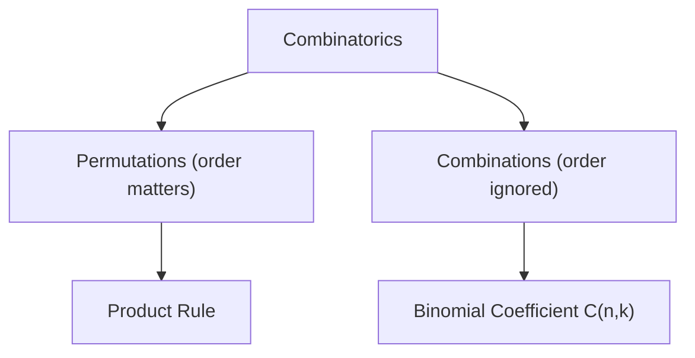

# Combinatorics

## Overview

Combinatorics is the mathematics of counting and arrangement. Given a finite set of objects, it answers questions like how many ways can you order them, choose some of them, or group them under constraints. At its heart are a few simple rules. The sum rule adds disjoint choices, the product rule multiplies independent stages, and from these grow permutations and combinations. Everything builds from the basic act of counting without listing every case by hand.

It matters because counting the size of a set often decides whether a problem is tractable. If a search space has a billion arrangements, you need a formula, not enumeration. Combinatorics gives that formula, and it also reveals hidden structure, symmetry, and identities. The recurring tension is between elegance and explosion. Choices multiply fast, so the skill is finding a clever way to count that avoids checking every possibility.

### Quick Takeaways

- It counts arrangements and selections of finite objects using structural rules
- Permutations count ordered picks, combinations count unordered picks
- The sum and product rules are the foundation everything else builds on

## Definition

- **Permutation** is an ordered arrangement of some or all objects from a set.
- **Combination** is a selection of objects where order does not matter.
- **Factorial** n! is the product of all positive integers up to n, counting full orderings.
- **Binomial coefficient** C(n,k) counts ways to choose k items from n.
- **Sum rule** adds the counts of mutually exclusive choices.
- **Product rule** multiplies the counts of independent sequential choices.

## The Analogy

Think of getting dressed from a wardrobe. If you pick one shirt from five and one pair of pants from three, the product rule says fifteen outfits. If order of putting them on does not matter, that is a combination. If you also care about the order you wear a hat, scarf, and gloves, that ordering is a permutation. Combinatorics is just careful bookkeeping of these everyday "how many ways" questions.

## When You See It

- Counting possible passwords, PINs, or license plates
- Calculating probabilities in card games and lotteries
- Sizing the search space of an algorithm
- Arranging teams, seatings, or schedules under constraints
- Expanding algebraic expressions with the binomial theorem
- Analyzing hashing and load distribution

## Examples

**Good:** Counting how many five-card poker hands exist from a 52-card deck as C(52,5). Order does not matter, so a combination gives the exact count of 2,598,960.

**Bad:** Using permutations to count poker hands, which overcounts because it treats the same five cards in different orders as distinct hands.

## Important Points

- The product rule handles independent stages, the sum rule handles exclusive alternatives
- Permutations count ordered outcomes, combinations count unordered ones
- The binomial coefficient C(n,k) equals n! divided by k!(n-k)!
- Pascal's triangle encodes binomial coefficients and their recurrence
- The pigeonhole principle guarantees collisions when items exceed containers
- Inclusion-exclusion corrects for overcounting overlapping sets
- Generating functions turn counting sequences into algebra
- Overcounting and undercounting are the most common mistakes

## Summary

- Combinatorics counts and arranges finite objects using structural rules.
- The sum and product rules are the building blocks for all counting.
- Permutations respect order while combinations ignore it.
- Tools like Pascal's triangle and inclusion-exclusion tame complex counts.
- It sizes search spaces and grounds discrete probability.
- _Count cleverly, because the arrangements multiply faster than you can list them._
