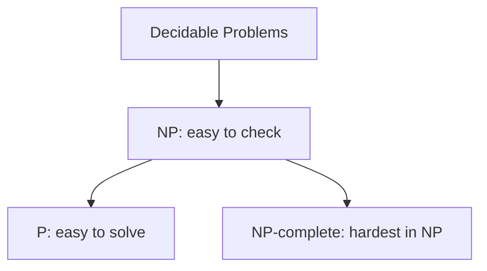
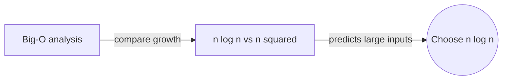
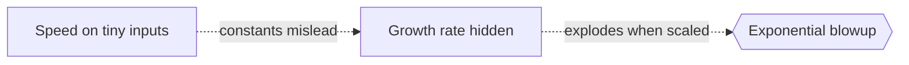

# Complexity Theory

## Overview

Complexity theory studies not whether a problem can be solved, but how expensive solving it is. It measures the resources an algorithm needs, chiefly time and memory, as a function of the input size. The core idea is to group problems into classes by how those resources grow. A problem that needs steps proportional to the input is cheap, while one that needs steps doubling with each added element is quickly hopeless. The growth rate, not the raw speed, is what matters.

It matters because it tells you in advance whether a problem is practically solvable at scale. The most famous open question, whether P equals NP, asks if every problem whose solution is easy to check is also easy to solve. Most experts believe not. The central tension is verification versus solution. Many problems let you verify an answer quickly yet seem to require searching an exponential space to find one, and complexity theory formalizes that gap.

### Quick Takeaways

- It measures how time and memory grow with input size
- Problems are grouped into classes like P and NP by difficulty
- The P versus NP question asks if checking equals solving

## Definition

- **Time complexity** is how the number of steps grows with input size.
- **Space complexity** is how much memory an algorithm needs as input grows.
- **Big-O notation** describes an upper bound on growth, ignoring constants.
- **Class P** is problems solvable in polynomial time.
- **Class NP** is problems whose solutions can be verified in polynomial time.
- **NP-complete** describes the hardest problems in NP, all equivalent in difficulty.

## The Analogy

Think of a jigsaw puzzle. Checking whether a finished puzzle is correct is fast, you just glance at the picture. But assembling it from scratch can take enormous effort, trying piece after piece. That gap between quick checking and slow solving is the heart of P versus NP. Complexity theory measures exactly how that effort scales as the puzzle grows from a hundred to a million pieces.

## When You See It

- Deciding whether an algorithm scales to large inputs
- Recognizing NP-hard problems and switching to approximation
- Choosing data structures by their asymptotic costs
- Reasoning about cryptography's reliance on hard problems
- Comparing algorithms by growth rate, not stopwatch time
- Setting realistic expectations for optimization tasks

## Examples

**Good:** Using big-O to see that a sorting algorithm running in n log n scales far better than one running in n squared. The comparison predicts behavior on huge inputs.

**Bad:** Judging an algorithm only by its speed on tiny test inputs. Constant factors can mislead, since an exponential method may look fine until the input grows.

## Important Points

- Complexity is about growth rate, not absolute running time
- Big-O captures worst-case scaling while ignoring constant factors
- Class P is considered the practical, tractable class
- NP problems are easy to verify but often hard to solve
- NP-complete problems are the hardest in NP and mutually reducible
- If any NP-complete problem is in P, then P equals NP
- Cryptography relies on certain problems staying hard
- Space complexity and parallelism add further dimensions of difficulty

## Summary

- Complexity theory measures the time and space problems require.
- It classifies problems by how resources grow with input size.
- Class P is tractable, NP is easy to verify but often hard to solve.
- NP-complete problems capture the hardest cases within NP.
- The P versus NP question asks if checking is as easy as solving.
- _Checking an answer can be quick, yet finding it may take forever._
