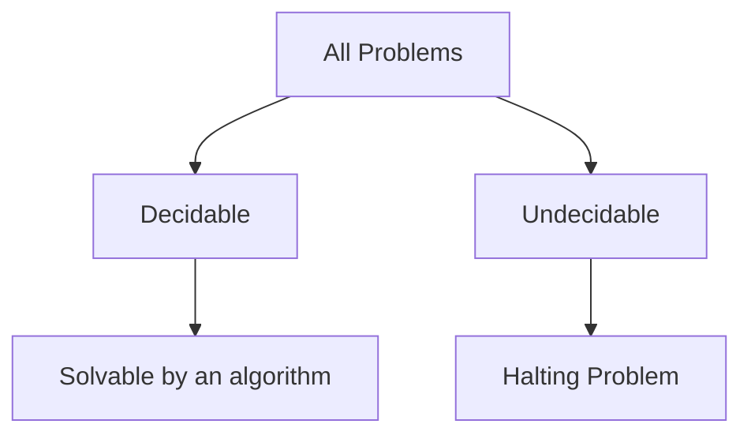

# Computability Theory

## Overview

Computability theory asks a single deep question: which problems can any algorithm solve, even given unlimited time and memory. It is not about speed but about possibility. Using idealized models like the Turing machine, it defines exactly what "solvable by an algorithm" means, then proves that some problems fall outside that boundary entirely. These undecidable problems have no algorithm that always halts with the right answer, no matter how clever.

It matters because it reveals hard, permanent limits on computing. The famous halting problem, deciding whether an arbitrary program stops, is provably unsolvable. That single result ripples outward, showing that many natural questions about programs cannot be answered mechanically. The central tension is that unlimited resources still are not enough. Some barriers are not about being slow, they are about being logically impossible, and computability theory maps exactly where those barriers lie.

### Quick Takeaways

- It studies what algorithms can solve, ignoring efficiency entirely
- Some problems, like the halting problem, are provably undecidable
- Undecidability is a limit of possibility, not of speed

## Definition

- **Decidable** describes a problem an algorithm can always solve and halt on.
- **Undecidable** describes a problem with no algorithm that always halts correctly.
- **Turing machine** is the abstract model defining algorithmic computation.
- **Halting problem** asks whether a given program halts on a given input.
- **Reduction** transforms one problem into another to transfer solvability.
- **Recursively enumerable** describes a set whose members can be listed by a machine.

## The Analogy

Imagine a librarian who promises to tell you, for any book, whether reading it will ever end or loop forever. For some books the answer is easy, but a self-referential book could describe the librarian's own decision and do the opposite. That paradox is why no such universal librarian can exist. The halting problem is exactly this trap, and computability theory proves the librarian is impossible.

## When You See It

- Determining that no general program-termination checker exists
- Recognizing undecidable questions in program verification
- Reasoning about the limits of static analysis tools
- Understanding why some type-checking problems are undecidable
- Classifying problems by degrees of unsolvability
- Grounding the Church-Turing thesis in formal models

## Examples

**Good:** Citing the undecidability of the halting problem to explain why a compiler cannot flag every infinite loop. It correctly bounds what tooling can promise.

**Bad:** Believing a smart-enough analyzer could decide whether any program halts. No algorithm can, so the effort is provably doomed regardless of cleverness.

## Important Points

- The subject concerns possibility, not efficiency or running time
- The halting problem is the archetypal undecidable problem
- Undecidability is proven by self-reference and diagonalization
- Reductions show new problems are undecidable by mapping to known ones
- Rice's theorem says most nontrivial questions about program behavior are undecidable
- Recursively enumerable sets can be listed but not always decided
- The Church-Turing thesis equates all reasonable models of computation
- Unlimited time and memory do not remove these barriers

## Summary

- Computability theory maps which problems any algorithm can solve.
- It concerns possibility, not speed, using models like Turing machines.
- The halting problem is provably undecidable by diagonalization.
- Rice's theorem extends undecidability to most program-behavior questions.
- These limits are logical, not overcome by more time or memory.
- _Some questions have no algorithm, no matter how much power you give it._
