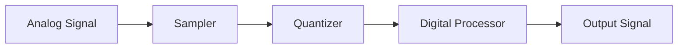
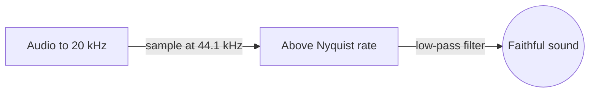
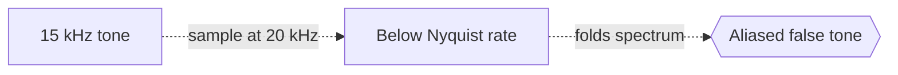

# Digital Signal Processing

## Overview

Digital signal processing, or DSP, manipulates signals after they have been turned into sequences of numbers. A continuous signal like sound or light is sampled at regular intervals, producing a discrete stream of values. DSP then works on this stream with arithmetic operations: adding, scaling, delaying, and combining samples to filter noise, detect patterns, or change the signal. The whole field lives in the discrete world, where a signal is just an indexed list of numbers.

It matters because nearly all modern audio, image, and communication systems are digital. Once a signal is numbers, you can process it with exact, repeatable operations that analog circuits cannot match. The central tension is sampling. You must sample fast enough to capture the signal faithfully, as the Nyquist theorem demands, or you lose information permanently through aliasing. Getting the discrete representation right is the foundation everything else rests on.

### Quick Takeaways

- DSP processes signals as discrete sequences of sampled numbers
- Sampling must respect the Nyquist rate to avoid aliasing
- Filters and the discrete Fourier transform are core tools

## Definition

- **Sampling** is measuring a continuous signal at regular time intervals.
- **Quantization** rounds each sample to a finite set of numeric levels.
- **Nyquist rate** is twice the highest frequency, the minimum safe sampling rate.
- **Aliasing** is distortion when a signal is sampled too slowly to represent it.
- **Filter** is an operation that emphasizes or removes chosen frequency components.
- **Discrete Fourier transform** decomposes a sampled signal into its frequency components.

## The Analogy

Think of a flip-book animation. Real motion is continuous, but the flip-book captures it as a series of still frames. If you draw enough frames per second, the motion looks smooth, but too few frames and the movement stutters or looks wrong. Sampling a signal is drawing those frames, and DSP is editing the flip-book frame by frame with arithmetic instead of a pen.

## When You See It

- Audio processing, equalizers, and noise reduction
- Image and video compression and enhancement
- Wireless communication and modulation
- Radar, sonar, and biomedical signal analysis
- Speech recognition front ends
- Sensor data filtering in embedded systems

## Examples

**Good:** Sampling audio at 44.1 kHz to cover the audible range up to about 20 kHz, then applying a digital low-pass filter to remove hiss. The rate satisfies Nyquist, so the sound is faithful.

**Bad:** Sampling a 15 kHz tone at only 20 kHz. That is below the Nyquist rate for the content, so aliasing folds the tone into a false lower frequency.

## Important Points

- A digital signal is a discrete sequence, so DSP is arithmetic on samples
- The Nyquist theorem requires sampling above twice the highest frequency
- Aliasing is irreversible, so anti-alias filtering happens before sampling
- Quantization introduces small rounding noise limited by bit depth
- The discrete Fourier transform reveals a signal's frequency content
- The fast Fourier transform computes it in n log n time
- FIR and IIR filters shape signals in the time and frequency domains
- Convolution in time equals multiplication in the frequency domain

## Summary

- DSP processes signals as discrete sequences of sampled numbers.
- Sampling and quantization convert continuous signals into data.
- The Nyquist rate must be met or aliasing corrupts the signal.
- The discrete Fourier transform and filters are the core tools.
- It powers audio, images, communications, and sensor systems.
- _Turn the signal into numbers, then edit the flip-book frame by frame._
