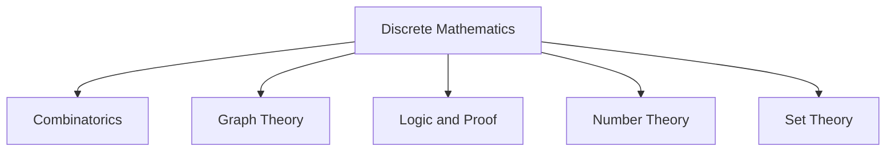
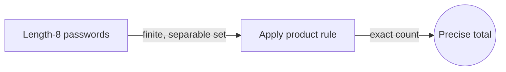
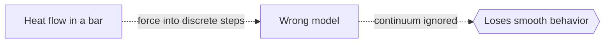

# Discrete Mathematics

## Overview

Discrete mathematics studies objects that come in separate, countable pieces. Instead of smooth curves and limits, it works with whole numbers, finite sets, graphs, logical statements, and step-by-step processes. The core idea is that many important systems have no in-between states. A switch is on or off, a node is connected or not, a proof step follows or it does not. Discrete math gives the tools to count, arrange, and reason about these clean, separable structures.

It matters because computers are discrete machines. Every bit, every memory cell, every clock tick is a distinct state, so the mathematics that describes them must be discrete too. The tension it resolves is scale. When you have a finite but enormous set of possibilities, brute force fails and you need counting rules, structural insight, and proof to say something certain. That is why discrete math underpins algorithms, cryptography, and formal verification.

### Quick Takeaways

- It studies countable, separate structures rather than continuous ones
- It is the mathematical foundation of computer science and algorithms
- Counting, logic, graphs, and proof are its recurring themes

## Definition

- **Discrete** means the objects are separate and countable, not blended on a continuum.
- **Set** is a collection of distinct elements treated as a single object.
- **Combinatorics** is the art of counting and arranging finite collections.
- **Graph** is a set of nodes joined by edges that model relationships.
- **Logic** is the formal system of statements, truth, and valid inference.
- **Algorithm** is a finite sequence of well defined steps that solves a problem.

## The Analogy

Think of a staircase versus a ramp. A ramp is continuous, you can stand at any height along it. A staircase is discrete, you can only stand on step one, two, or three, never at step 2.4. Discrete mathematics is the math of staircases. It counts the steps, describes how they connect, and reasons about paths across them, without ever needing the smooth in-between of the ramp.

## When You See It

- Analyzing algorithm running time and correctness
- Designing data structures like trees, graphs, and hash tables
- Cryptography built on modular arithmetic and number theory
- Database queries and relational logic
- Network routing and connectivity problems
- Formal verification and digital circuit design

## Examples

**Good:** Counting how many distinct passwords of length eight exist over a fixed alphabet. The set is finite and separable, so a counting rule gives an exact answer.

**Bad:** Using discrete methods to model the smooth flow of heat through a metal bar. That is a continuous process better handled by calculus and differential equations.

## Important Points

- Discrete math trades smoothness for countability, enabling exact reasoning over finite structures
- It is not one topic but a family: combinatorics, graph theory, logic, number theory, and more
- Proof techniques like induction fit naturally because objects are built step by step
- Counting arguments turn vague "how many" questions into precise formulas
- Graphs model relationships, from social networks to dependency chains
- It powers computing because digital systems are inherently discrete
- Many discrete problems are easy to state yet computationally hard to solve
- Recurrence relations describe sequences defined in terms of earlier terms

## Summary

- Discrete mathematics studies separate, countable structures instead of continuous ones.
- Its main branches include combinatorics, graph theory, logic, and number theory.
- It is the mathematical backbone of computer science and algorithm design.
- Induction and counting arguments are its signature proof techniques.
- Problems are often simple to state but surprisingly hard to compute.
- _It counts the steps of the staircase and never worries about the space between them._
