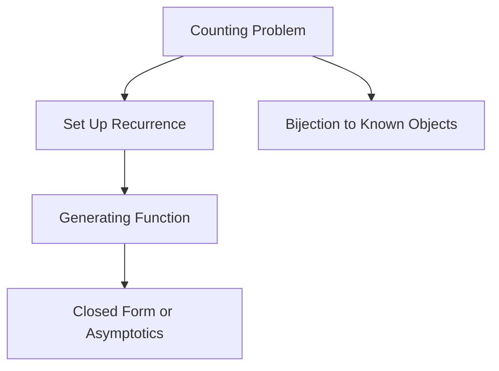
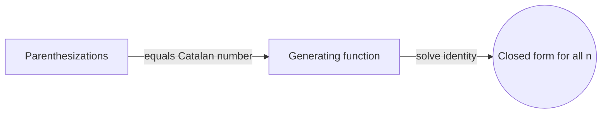

# Enumerative Combinatorics

## Overview

Enumerative combinatorics is the science of counting exactly. Given a family of structures indexed by a size n, such as trees on n nodes or ways to tile a strip, it seeks a formula or method that returns the count for every n. The goal is not to list the objects but to describe how their number grows. Sometimes the answer is a clean closed form, sometimes a recurrence, and sometimes a generating function that packs the entire sequence into a single algebraic object.

It matters because a count is often the first thing you need to know about a structure. It tells you the size of a search space, the probability of a random event, or whether a brute-force approach is hopeless. The recurring tension is between explicit formulas and computable methods. A messy problem may have no neat formula, yet a recurrence or generating function still lets you compute or estimate the count efficiently.

### Quick Takeaways

- It finds formulas or methods to count structures of every size n
- Generating functions encode a whole counting sequence as one algebraic object
- Recurrences let you compute counts even without a closed form

## Definition

- **Enumeration** is determining the exact number of structures of a given size.
- **Closed form** is an explicit formula, such as a factorial or power, for the count.
- **Recurrence relation** defines a count in terms of counts for smaller sizes.
- **Generating function** encodes a sequence as coefficients of a formal power series.
- **Bijection** is a one-to-one correspondence proving two sets have equal size.
- **Catalan number** counts many structures like balanced parentheses and binary trees.

## The Analogy

Think of a coin-sorting machine that never dumps the coins out to count them one by one. Instead it knows a rule: given last month's totals, it predicts this month's. Enumerative combinatorics works the same way. Rather than listing every arrangement, it finds the rule, the recurrence, or the formula that gives the total directly, no matter how large the pile grows.

## When You See It

- Estimating the size of an algorithm's search space
- Counting lattice paths, tilings, and triangulations
- Deriving probabilities in discrete random models
- Analyzing data structures like the number of binary trees
- Solving recurrences that arise in divide-and-conquer analysis
- Proving identities through bijective arguments

## Examples

**Good:** Proving the number of ways to fully parenthesize a product equals the Catalan number, then using a generating function to derive its closed form. The whole sequence follows from one algebraic identity.

**Bad:** Trying to count binary trees of size 30 by listing every tree. The count explodes into the billions, so enumeration by listing is hopeless without a formula.

## Important Points

- The aim is the count as a function of n, not a list of the objects
- Recurrences turn a hard direct count into a step-by-step computation
- Generating functions convert counting problems into algebra
- Bijections prove two counts are equal by pairing their objects
- The twelvefold way organizes basic counting problems into a single table
- Catalan and Stirling numbers recur across many different structures
- Asymptotic analysis describes growth when exact formulas are unavailable
- Sign-reversing involutions prove identities by cancellation

## Summary

- Enumerative combinatorics counts structures exactly as a function of size.
- It uses closed forms, recurrences, generating functions, and bijections.
- Generating functions pack an entire sequence into one algebraic object.
- Bijections prove equal counts by pairing objects one to one.
- Counts reveal search-space size and discrete probabilities.
- _Do not list the pile, find the rule that tells you its size._
