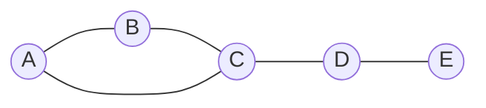

# Graph Theory

## Overview

Graph theory studies networks of nodes joined by edges. A graph is just a set of vertices and a set of connections between them, yet this simple idea models an enormous range of systems: roads between cities, links between web pages, friendships between people. The power comes from abstraction. Once you strip a problem down to which things are connected to which, general graph results apply regardless of what the nodes actually represent.

It matters because relationships, not just individual objects, drive most real systems. Questions like the shortest route, the most central node, or whether a network stays connected after failures are all graph questions. The recurring tension is between local edges and global structure. Simple rules about individual connections produce surprising emergent properties like clustering, reachability, and bottlenecks that only appear at the whole-graph level.

### Quick Takeaways

- A graph is vertices connected by edges, modeling pairwise relationships
- Local connections give rise to global properties like reachability and cycles
- Graph algorithms answer routing, connectivity, and centrality questions

## Definition

- **Vertex** is a node, one of the objects the graph connects.
- **Edge** is a link joining two vertices, directed or undirected.
- **Path** is a sequence of edges connecting one vertex to another.
- **Cycle** is a path that returns to its starting vertex.
- **Degree** is the number of edges incident to a vertex.
- **Connected** means every pair of vertices has a path between them.

## The Analogy

Think of a subway map. The stations are vertices and the track segments are edges. You do not care about the exact distance or shape of the tracks, only which stations connect to which. That is exactly a graph. Planning a trip becomes finding a path, and asking whether the whole city is reachable becomes asking whether the graph is connected.

## When You See It

- Routing and navigation in maps and networks
- Social network analysis and recommendation systems
- Web page ranking and link analysis
- Dependency resolution in build systems and package managers
- Scheduling and resource conflicts via graph coloring
- Circuit design and network reliability

## Examples

**Good:** Modeling a road network as a weighted graph and running Dijkstra's algorithm to find the shortest route. Vertices are intersections and edge weights are distances.

**Bad:** Using a graph to model a quantity that changes continuously over time, like temperature, where there are no discrete nodes or pairwise links to represent.

## Important Points

- A graph captures only what connects to what, ignoring irrelevant detail
- Directed graphs model one-way relations, undirected model mutual ones
- Trees are connected graphs with no cycles and exactly n-1 edges
- Breadth-first and depth-first search explore reachability and structure
- Shortest-path algorithms like Dijkstra handle weighted routing
- Graph coloring models conflict-free scheduling and register allocation
- Euler paths cross every edge once, Hamiltonian paths visit every vertex once
- Many graph problems are efficient, but some like Hamiltonian cycle are NP-hard

## Summary

- Graph theory models systems as vertices connected by edges.
- Its abstraction lets one result apply across many domains.
- Paths, cycles, degree, and connectivity are the core concepts.
- Search and shortest-path algorithms answer practical routing questions.
- Local edges produce global properties like reachability and bottlenecks.
- _Care only about what connects to what, and the rest of the map falls away._
