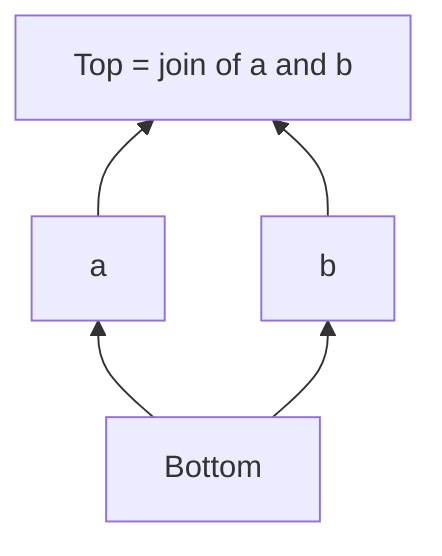

# Lattice Theory

## Overview

Lattice theory studies a special kind of partial order where structure is guaranteed. A lattice is a partially ordered set in which every pair of elements has both a least upper bound, called the join, and a greatest lower bound, called the meet. This means you can always combine two elements into their smallest common superior and their largest common inferior. That guarantee turns a loose ordering into an algebraic system with two well behaved operations.

It matters because meet and join model "and" and "or", "min" and "max", intersection and union, all at once. This unifies logic, set theory, and type systems under one framework. The recurring tension is between the order view and the algebra view. A lattice can be seen as an ordering with bounds or as a set with two operations, and switching between these viewpoints is where much of the theory's power lies.

### Quick Takeaways

- A lattice is a partial order where every pair has a meet and a join
- Meet and join generalize min and max, and intersection and union
- Lattices bridge order theory and algebra with two operations

## Definition

- **Join** is the least upper bound of two elements, written a or b.
- **Meet** is the greatest lower bound of two elements, written a and b.
- **Lattice** is a partial order where every pair has both a meet and a join.
- **Bounded lattice** has a greatest element top and a least element bottom.
- **Distributive lattice** is one where meet distributes over join and vice versa.
- **Complete lattice** guarantees meets and joins for every subset, not just pairs.

## The Analogy

Think of two folders in a file system. Their "meet" is the deepest common parent folder that contains both, and their "join" is the smallest scope you would need to cover both. No matter which two folders you pick, those common bounds always exist. A lattice is any ordered world with that guarantee: any two things have a well defined common floor and common ceiling.

## When You See It

- Type systems computing common supertypes and subtypes
- Program analysis where data-flow values form a lattice
- Boolean algebra and propositional logic
- Set operations of union and intersection
- Access control and security level hierarchies
- Concept hierarchies in formal concept analysis

## Examples

**Good:** Using a lattice of program states in static analysis, where join merges information at control-flow joins. The guaranteed least upper bound makes the analysis well defined and convergent.

**Bad:** Treating an arbitrary partial order as a lattice when some pairs have no least upper bound. The join is undefined, so lattice-based algorithms break.

## Important Points

- The defining property is that every pair has both a meet and a join
- Meet and join obey commutative, associative, and absorption laws
- A lattice can be viewed as an order or as an algebra with two operations
- Bounded lattices add a top and bottom element for total coverage
- Distributive lattices let meet and join distribute like and and or
- Complete lattices extend bounds to all subsets, key to fixed-point theory
- The Knaster-Tarski theorem guarantees fixed points on complete lattices
- Boolean algebras are complemented distributive lattices

## Summary

- A lattice is a partial order where every pair has a meet and a join.
- Meet and join generalize min and max, intersection and union.
- Lattices can be studied as orders or as two-operation algebras.
- Complete lattices underpin fixed-point theorems used in analysis.
- They unify logic, set theory, types, and program analysis.
- _Pick any two elements, and their common floor and ceiling always exist._
