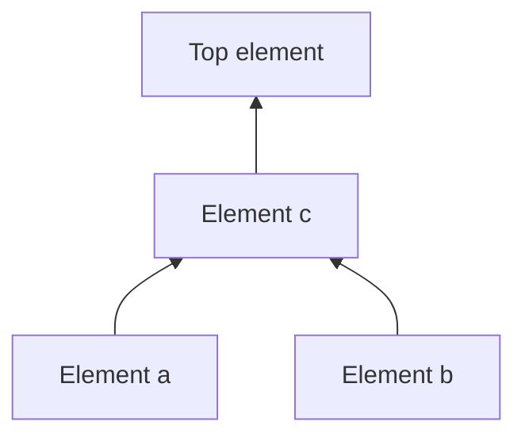
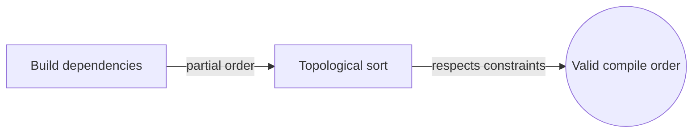

# Order Theory

## Overview

Order theory studies the idea of "comes before" in a precise way. It takes a set and equips it with a relation that says when one element is less than, or precedes, another. The key insight is that ordering does not require every pair to be comparable. In a partial order some elements simply cannot be ranked against each other, like two unrelated tasks with no dependency. This generalizes the familiar number line into a much richer landscape of structured comparison.

It matters because dependencies, hierarchies, and priorities are everywhere in computing and mathematics. Task scheduling, type systems, and version histories all rest on partial orders. The central tension is between total and partial comparability. A total order ranks everything cleanly, but real systems often have incomparable elements, and order theory gives the vocabulary to handle both cases with the same tools.

### Quick Takeaways

- An order relation formalizes "precedes" or "is less than or equal to"
- Partial orders allow incomparable elements, unlike total orders
- Hasse diagrams draw an order by its direct covering relations

## Definition

- **Partial order** is a relation that is reflexive, antisymmetric, and transitive.
- **Total order** is a partial order in which every pair of elements is comparable.
- **Comparable** means one of two elements precedes the other under the relation.
- **Least upper bound** is the smallest element that is at least as large as a given set.
- **Hasse diagram** draws a partial order using only direct cover relations.
- **Chain** is a subset in which every pair of elements is comparable.

## The Analogy

Think of getting dressed. Socks must go on before shoes, and a shirt before a jacket, but socks and shirt have no required order between them. You can put either on first. That is a partial order. Some steps have a forced sequence, others are independent. Order theory is the mathematics of exactly these "must come before" and "does not matter" relationships.

## When You See It

- Task scheduling with dependency constraints
- Type hierarchies and subtyping in programming languages
- Version control and commit ancestry
- Database query optimization over lattices of plans
- Priority and precedence in event systems
- Sorting and ranking with ties or incomparabilities

## Examples

**Good:** Modeling build dependencies as a partial order and using a topological sort to find a valid compile sequence. Independent modules stay incomparable and can build in any order.

**Bad:** Forcing a total order on tasks that are genuinely independent, inventing a rank between them that does not exist and creating false constraints.

## Important Points

- A partial order needs reflexivity, antisymmetry, and transitivity
- Total orders are the special case where everything is comparable
- Incomparable elements are a feature, not a defect, of partial orders
- Hasse diagrams show only cover relations, keeping pictures clean
- Least and greatest elements may or may not exist in a given order
- Topological sorting linearizes a partial order respecting all constraints
- Chains are fully ordered subsets, antichains are fully incomparable ones
- Dilworth's theorem links the largest antichain to a chain cover

## Summary

- Order theory formalizes when one element precedes another.
- Partial orders allow incomparable pairs, generalizing the number line.
- Reflexivity, antisymmetry, and transitivity define a partial order.
- Hasse diagrams and topological sorts make orders concrete and usable.
- Dependencies, hierarchies, and priorities all rest on order relations.
- _Some steps must come first, and some simply do not care about order._
