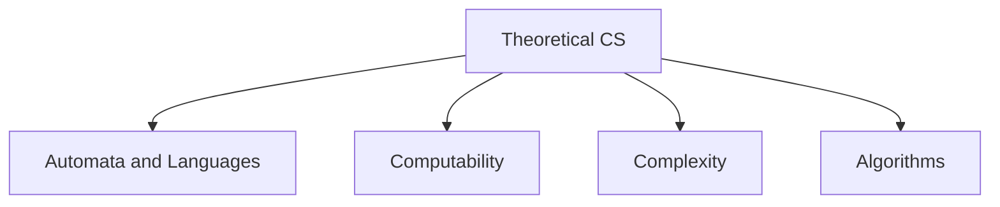
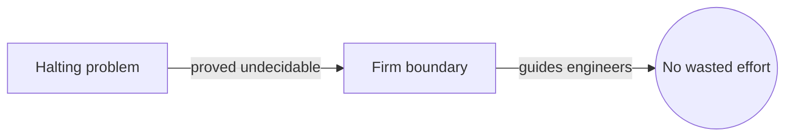
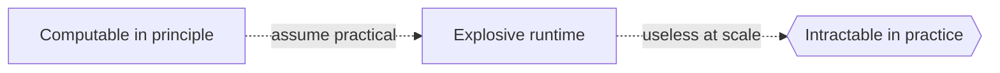

# Theoretical Computer Science

## Overview

Theoretical computer science is the mathematics of computation itself. Instead of building programs, it studies what computation is, what problems can be solved by any machine, and how much time or space a solution requires. It uses formal models like automata and Turing machines to pin down the notion of an algorithm precisely, then proves what those models can and cannot do. The subject is discrete through and through, dealing with symbols, states, and finite steps.

It matters because it draws the hard boundaries of computing. Some problems are impossible to solve by any program, and others are solvable only at astronomical cost. Knowing these limits saves wasted effort and guides where to look for clever algorithms or good approximations. The recurring tension is between possibility and practicality. A problem can be computable in principle yet hopelessly slow, so theory separates "can be done" from "can be done efficiently."

### Quick Takeaways

- It studies what can be computed and how efficiently, using formal models
- Computability marks the boundary of what any machine can solve
- Complexity measures the resources a solution truly requires

## Definition

- **Algorithm** is a finite, well defined procedure that solves a class of problems.
- **Turing machine** is an abstract model defining what is computable in principle.
- **Computability** is the study of which problems can be solved by any algorithm.
- **Complexity** is the study of the time and space algorithms require.
- **Formal language** is a set of strings defined by precise rules.
- **Decidable problem** is one an algorithm can always answer correctly and halt.

## The Analogy

Think of theoretical computer science as the physics of computing. Physics does not build a specific bridge, it discovers the laws that say which bridges can stand and how much load they bear. Likewise, theory does not write a specific app, it uncovers the laws that say which problems can be solved at all and how costly the solution must be. It is the rulebook every program silently obeys.

## When You See It

- Proving a problem has no efficient algorithm
- Classifying problems as tractable or intractable
- Designing and analyzing algorithms formally
- Building compilers and language recognizers from automata
- Reasoning about cryptographic hardness assumptions
- Verifying program correctness with formal logic

## Examples

**Good:** Proving the halting problem is undecidable, which tells engineers not to seek a universal program that predicts whether any program stops. It sets a firm, useful limit.

**Bad:** Assuming that because a problem is computable, it is also practical to solve. Many computable problems require time that grows so fast they are useless in practice.

## Important Points

- The field pins down "algorithm" and "computation" with formal models
- Computability separates solvable problems from provably impossible ones
- The halting problem is the classic example of an undecidable problem
- Complexity classes like P and NP organize problems by resource needs
- The Church-Turing thesis says all reasonable models compute the same functions
- Reductions transfer hardness from one problem to another
- Automata and formal languages underpin parsing and compilers
- Lower bounds prove no algorithm can beat a certain cost

## Summary

- Theoretical computer science studies the nature and limits of computation.
- It uses formal models like Turing machines to define computability.
- Some problems, like the halting problem, are provably unsolvable.
- Complexity theory measures the time and space solutions demand.
- It separates what can be computed from what can be computed efficiently.
- _It is the physics of computing, the laws every program must obey._
