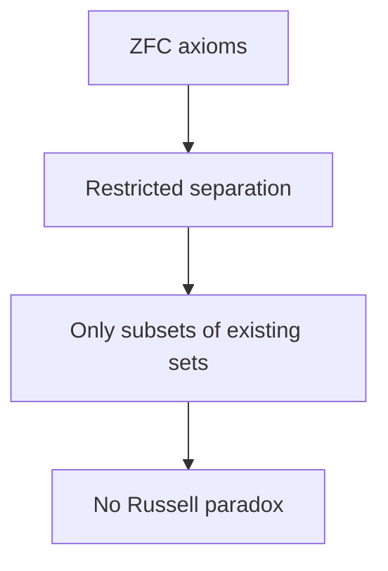

# Axiomatic Set Theory

## Overview

Axiomatic set theory rebuilds set theory on a small list of precise axioms. Instead of forming sets from any property, it allows only the constructions the axioms permit. The standard system is Zermelo-Fraenkel set theory, usually taken with the axiom of choice and abbreviated ZFC. Its axioms say things like "two sets are equal when they share elements" and "you can form the set of subsets of a set." This controlled approach blocks the paradoxes that destroyed naive set theory.

It matters because it is the working foundation for most of mathematics. Nearly every theorem can, in principle, be traced back to ZFC axioms. The key fix is replacing unrestricted comprehension with restricted separation, so you can only carve subsets out of sets that already exist. This stops Russell's paradox. Powerful results and open questions live here too, such as the independence of the continuum hypothesis, which ZFC can neither prove nor disprove.

### Quick Takeaways

- Sets are built only through explicit, restricted axioms
- ZFC is the standard system and mainstream foundation
- Restricted separation blocks the naive paradoxes

## Definition

- **ZFC** is Zermelo-Fraenkel set theory together with the axiom of choice.
- **Axiom of extensionality** states sets with the same elements are equal.
- **Axiom schema of separation** allows forming subsets defined by a property.
- **Axiom of choice** lets you pick one element from each set in a collection.
- **Axiom of foundation** forbids infinite descending membership chains.
- **Axiom of infinity** guarantees the existence of an infinite set.

## The Analogy

Think of building with a strict permit system instead of a free-for-all. Naive set theory let anyone build anything, and some buildings collapsed. Axiomatic set theory issues a fixed set of permits: you may only construct what the rules explicitly allow, such as subsets of what already stands. The permits are chosen so that no allowed building can ever collapse into paradox.

## When You See It

- Citing ZFC as the base for a proof or definition
- Discussing the axiom of choice and its consequences
- Explaining why the continuum hypothesis is independent
- Building formal models of set theory
- Justifying that a construction is legitimate under the axioms
- Comparing ZFC with alternative foundations

## Examples

**Good:** Using the separation axiom to form the subset of a set whose elements satisfy a property. The parent set already exists, so no paradox can arise.

**Bad:** Trying to form the set of all sets directly. ZFC has no axiom permitting a universal set, precisely to avoid the old contradictions.

## Important Points

- ZFC replaces unrestricted comprehension with restricted separation
- Extensionality fixes when two sets count as equal
- The axiom of choice is independent and sometimes controversial
- Foundation rules out sets that contain themselves in a loop
- Infinity guarantees at least one infinite set exists
- The continuum hypothesis is independent of ZFC
- Gödel's second theorem means ZFC cannot prove its own consistency

## Summary

- Axiomatic set theory builds sets from explicit, restricted axioms.
- ZFC is the standard system and mainstream foundation.
- Restricted separation prevents Russell's paradox.
- The axiom of choice adds power and some controversy.
- Deep questions like the continuum hypothesis are independent of it.
- _It trades naive freedom for careful rules, and buys back consistency._
