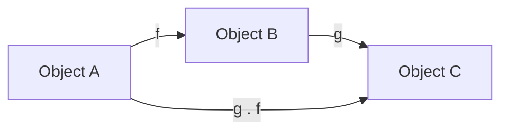
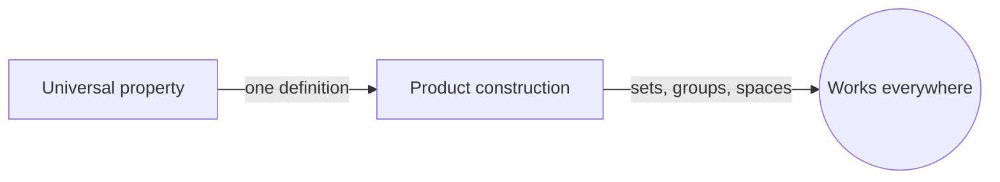
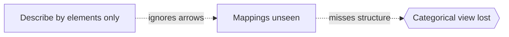

# Category Theory

## Overview

Category theory studies mathematical structure through relationships rather than internal contents. A category has objects and arrows, called morphisms, that go between objects. The only rules are that arrows compose and that each object has an identity arrow. Remarkably, you can describe a huge amount of mathematics with just this. Instead of asking what an object is made of, category theory asks how it maps to and from other objects. Structure lives in the arrows.

It matters because it unifies patterns that appear across many fields. Groups, sets, spaces, and vector spaces all form categories, and the same constructions recur in each. Functors map one category to another while preserving structure, and natural transformations map between functors. This gives a precise language for saying two constructions are "essentially the same." Category theory even serves as an alternative foundation, describing mathematics by structure and mapping instead of by membership.

### Quick Takeaways

- A category is objects plus composable arrows with identities
- Structure is captured by mappings, not internal contents
- Functors and natural transformations relate whole categories

## Definition

- **Category** is a collection of objects and arrows that compose with identities.
- **Morphism** is an arrow from one object to another, the basic relationship.
- **Composition** is combining two compatible arrows into one.
- **Functor** is a structure-preserving map between two categories.
- **Natural transformation** is a mapping between two functors.
- **Isomorphism** is an arrow with a two-sided inverse, meaning objects are essentially the same.

## The Analogy

Think of a subway map. It does not show what each station is built from, only how stations connect by lines. You can plan any trip using just the connections and how they join. Category theory is that subway map for mathematics. It ignores the internal makeup of objects and reasons entirely from how they link and how those links compose.

## When You See It

- Unifying constructions across algebra, topology, and logic
- Describing universal properties like products and limits
- Formalizing "essentially the same" through isomorphism
- Underpinning functional programming abstractions
- Serving as an alternative foundation to set theory
- Relating theories via functors and equivalences

## Examples

**Good:** Defining a product by a universal property, so it works the same way for sets, groups, and spaces. One definition captures many concrete cases at once.

**Bad:** Insisting on describing an object only by its internal elements when the useful information is how it maps to others. That misses the point of the categorical view.

## Important Points

- Objects and arrows, not elements, are the primitive notions
- Composition and identities are the only structural axioms
- Universal properties define constructions up to isomorphism
- Functors preserve structure between categories
- Natural transformations compare functors coherently
- The same patterns recur across many areas of mathematics
- Category theory can act as a foundation based on structure

## Summary

- Category theory describes structure through objects and arrows.
- It emphasizes mappings over the internal makeup of objects.
- Functors and natural transformations relate whole categories.
- Universal properties give uniform definitions across fields.
- It offers a structural alternative to set-theoretic foundations.
- _It teaches that what a thing is matters less than how it connects._
