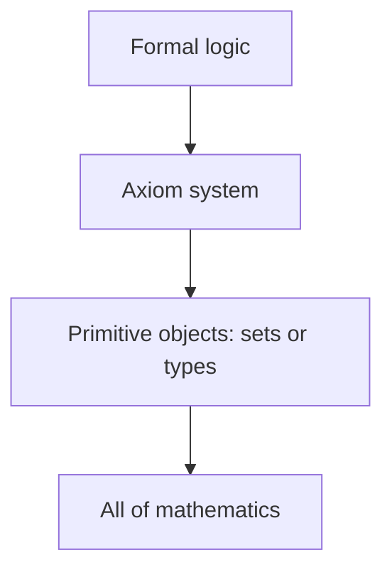
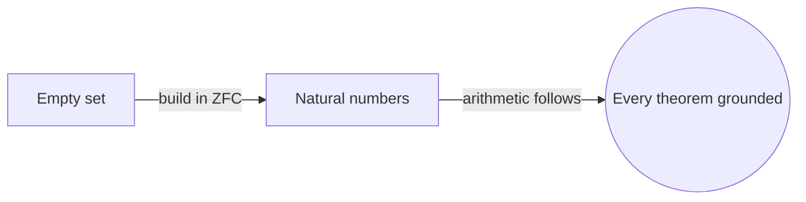
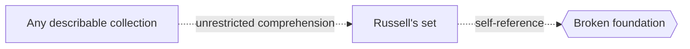

# Foundations of Mathematics

## Overview

Foundations of mathematics asks a simple but deep question. What are the starting points from which every theorem follows? Instead of proving results about numbers or shapes directly, it studies the rules of the game itself. It looks at the axioms we assume, the logic we use to reason, and the objects like sets or types that everything else is defined from. The goal is a small, clear base that the rest of mathematics can stand on without hidden gaps.

This matters because mathematics claims certainty, and certainty needs a trustworthy bottom layer. A crisis around 1900, driven by paradoxes in early set theory, showed that casual assumptions could lead to contradictions. Foundations grew out of the drive to fix this. Today the mainstream base is axiomatic set theory paired with formal logic, though category theory and type theory offer rival or complementary bases. The key tension is between wanting a foundation strong enough to build everything and weak enough to stay consistent.

### Quick Takeaways

- Foundations studies the axioms, logic, and primitive objects mathematics rests on
- Paradoxes in naive set theory forced the shift to careful axiomatic systems
- Common bases include set theory, category theory, and type theory

## Definition

- **Axiom** is a statement assumed true without proof, used as a starting point.
- **Formal system** is a precise set of symbols, rules, and axioms for deriving theorems.
- **Consistency** is the property that a system cannot prove both a statement and its negation.
- **Set theory** is the most common foundation, building objects from the notion of a set.
- **Type theory** is an alternative base where every object carries a type that constrains it.
- **Metamathematics** is the study of mathematical systems using mathematical methods.

## The Analogy

Think of building a skyscraper. Before any floor goes up, engineers pour a foundation and check the bedrock. If the ground is soft or cracked, every floor above is at risk. Foundations of mathematics is that bedrock inspection. It does not care about the penthouse view. It cares whether the base can hold the whole structure without sinking or splitting.

## When You See It

- Debates over which axioms to accept, such as the axiom of choice
- Proof assistants and formal verification that need a rigorous base
- Discussions of whether a result depends on set theory or something weaker
- Explaining why naive set theory was abandoned for axiomatic versions
- Comparing set-based and category-based views of the same structure
- Teaching how numbers can be constructed from pure sets

## Examples

**Good:** Constructing the natural numbers from the empty set inside ZFC, so arithmetic rests on a single agreed axiom system. Every later theorem traces back to those axioms.

**Bad:** Assuming "a set is just any collection you can describe" and reasoning freely from it. That naive view leads straight to Russell's paradox and a broken foundation.

## Important Points

- Foundations separates what we assume from what we prove
- The 1900s foundational crisis was triggered by set-theoretic paradoxes
- ZFC set theory is the de facto standard base for most mathematics
- Category theory reframes foundations around structure and mappings
- Type theory underlies many modern proof assistants
- Gödel showed no rich consistent system can prove its own consistency
- Choice of foundation can change which theorems are provable
- A good foundation aims to be both expressive and consistent

## Summary

- Foundations studies the axioms, logic, and objects mathematics is built from.
- It arose to repair paradoxes that broke early informal set theory.
- Axiomatic set theory is the mainstream base, with category and type theory as alternatives.
- The core trade-off is between expressive power and provable consistency.
- Gödel's limits show any strong base has questions it cannot settle about itself.
- _We rarely inspect the ground we stand on, but every theorem depends on it._
