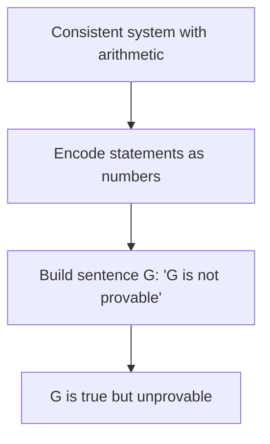
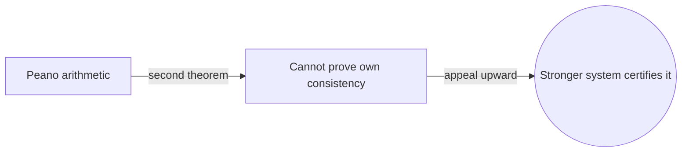

# Gödel's Incompleteness Theorems

## Overview

Gödel's incompleteness theorems set hard limits on formal systems. Take any consistent formal system strong enough to describe basic arithmetic. The first theorem says there is a true statement about numbers that the system can neither prove nor disprove. The second theorem says such a system cannot prove its own consistency. These are not gaps that better axioms would close. Any patch strong enough still leaves new unprovable truths.

They matter because they ended a dream. Hilbert hoped to find one complete, consistent set of axioms that settled every mathematical question and proved its own safety. Gödel showed that dream is impossible for any rich enough system. The trick was coding statements as numbers, so a system could talk about itself, then building a sentence that in effect says "this statement is not provable." If the system is consistent, that sentence is true but unprovable. The result reshaped logic, philosophy, and computer science.

### Quick Takeaways

- Any consistent system strong enough for arithmetic has true but unprovable statements
- No such system can prove its own consistency from within
- Adding axioms never fully removes incompleteness

## Definition

- **Consistency** is the property that a system proves no statement and its negation both.
- **Completeness** is the property that every true statement of the system is provable.
- **Gödel numbering** is a coding of formulas and proofs as natural numbers.
- **The Gödel sentence** is a self-referential statement asserting its own unprovability.
- **Effective axiomatization** means the axioms can be listed by a finite mechanical procedure.
- **Omega-consistency** is a technical strengthening of consistency used in the original proof.

## The Analogy

Imagine a rulebook so complete it claims to answer every question about a game. Now write a card that says "this card cannot be produced by the rulebook." If the rulebook could produce it, the card would be false, breaking the rules. So it cannot produce a card that is nevertheless clearly true. The rulebook is powerful yet forever incomplete, and it cannot certify its own reliability.

## When You See It

- Arguments about the limits of formal reasoning and automation
- Explaining why no single axiom set decides every arithmetic truth
- The link between unprovability and the halting problem
- Debates on whether minds exceed formal systems
- Why proof assistants rely on assumed, not proven, consistency
- Discussions of independence results like the continuum hypothesis

## Examples

**Good:** Citing incompleteness to explain why Peano arithmetic cannot prove its own consistency, so we appeal to a stronger system to justify it. This is the second theorem in action.

**Bad:** Claiming incompleteness proves "mathematics is broken" or that anything can be true. The theorems are precise limits, not a license for vagueness.

## Important Points

- The theorems apply to consistent, effectively axiomatized, arithmetic-capable systems
- The first theorem gives a true but unprovable statement
- The second theorem blocks internal proofs of consistency
- Gödel numbering lets a system encode statements about itself
- The Gödel sentence is diagonal and self-referential by design
- Incompleteness is deeply tied to the undecidability of the halting problem
- Stronger systems can prove weaker ones consistent, never themselves

## Summary

- Any rich consistent system has true statements it cannot prove.
- No such system can establish its own consistency internally.
- Gödel numbering enables the crucial self-reference in the proof.
- The results ended Hilbert's dream of a complete, self-certifying base.
- They connect logic to computability and the halting problem.
- _Every strong enough system can see truths it will never be able to prove._
