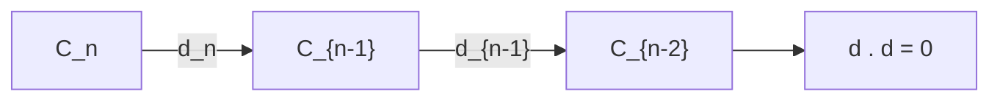
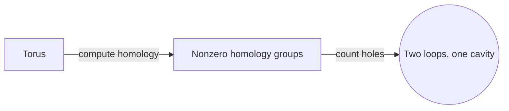
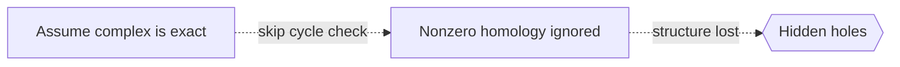

# Homological Algebra

## Overview

Homological algebra studies sequences of maps between algebraic objects and what those sequences fail to capture. The core setup is a chain complex, a sequence of objects linked by maps where applying two consecutive maps gives zero. That "boundary of a boundary is zero" rule is the whole engine. Homology measures the gap between what could be a boundary and what actually is one. When the gap is nonzero, it signals a hole or an obstruction that the maps cannot smooth away.

It matters because this single idea explains structure across many fields. Topology uses homology to count holes in shapes. Algebra uses it to measure how far a sequence is from being exact. Tools like exact sequences, derived functors, and Ext and Tor turn subtle questions into computable invariants. Homological algebra grew from topology but became a general language, and it connects tightly to category theory through functors and their derived versions.

### Quick Takeaways

- A chain complex has maps where two in a row compose to zero
- Homology measures the failure of a sequence to be exact
- Nonzero homology signals holes or algebraic obstructions

## Definition

- **Chain complex** is a sequence of objects with maps whose consecutive composite is zero.
- **Boundary map** is the map in a complex that sends each object to the next.
- **Cycle** is an element mapped to zero by the boundary map.
- **Boundary** is an element that is the image of the previous boundary map.
- **Homology** is the quotient of cycles by boundaries, measuring the gap between them.
- **Exact sequence** is a complex where cycles and boundaries coincide, so homology is zero.

## The Analogy

Think of a loop drawn on a surface. On a flat sheet you can always shrink the loop to a point. On a doughnut, a loop around the hole cannot shrink no matter how you slide it. That stubborn loop is a nonzero homology class. Homological algebra generalizes this: it measures the loops that are cycles but are not boundaries of anything, revealing hidden holes.

## When You See It

- Counting holes and connectivity of topological spaces
- Measuring how far an algebraic sequence is from exact
- Computing invariants like Ext and Tor
- Building derived functors from ordinary ones
- Studying resolutions of modules
- Connecting algebra and topology through functors

## Examples

**Good:** Computing the homology of a torus to detect its two independent loops and one cavity. The nonzero groups precisely count its holes.

**Bad:** Treating a chain complex as exact without checking that cycles equal boundaries. If homology is nonzero, assuming exactness hides real structure.

## Important Points

- The rule that boundary of a boundary is zero drives everything
- Homology is cycles modulo boundaries
- Exactness means homology vanishes at that spot
- Long exact sequences relate the homology of related objects
- Derived functors like Ext and Tor measure inexactness
- The subject unifies topology and algebra
- It is naturally expressed in the language of category theory

## Summary

- Homological algebra studies chain complexes and their homology.
- The key rule is that two consecutive maps compose to zero.
- Homology measures the failure of a sequence to be exact.
- Nonzero homology reveals holes or obstructions.
- It unifies topology and algebra through derived functors.
- _It counts the holes you cannot fill, turning absence into a number._
