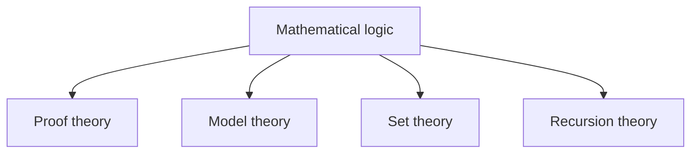
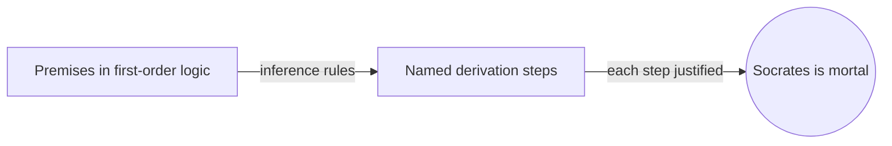
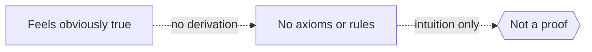

# Mathematical Logic

## Overview

Mathematical logic turns reasoning itself into a mathematical object. It replaces vague words like "therefore" and "implies" with exact symbols and rules. A logical language fixes what counts as a well-formed statement. A set of inference rules fixes which steps are allowed in a proof. Once reasoning is this precise, we can prove things about proofs, not just with them. This is what makes logic the toolkit of foundations.

Logic matters because it draws a sharp line between what is provable and what is true. Syntax covers the mechanical side, the symbols and derivation rules. Semantics covers meaning, assigning truth values in some interpretation. The bridge between them is soundness and completeness. Mathematical logic splits into four classic branches: proof theory, model theory, set theory, and recursion theory. Each studies a different face of formal reasoning, and together they map the limits of what mathematics can do.

### Quick Takeaways

- Logic makes reasoning formal, so proofs become objects we can analyze
- Syntax handles symbols and rules, semantics handles meaning and truth
- Its four branches are proof theory, model theory, set theory, and recursion theory

## Definition

- **Proposition** is a statement that is either true or false in a given setting.
- **First-order logic** is the standard language with quantifiers over individual objects.
- **Inference rule** is a permitted step that derives a new statement from earlier ones.
- **Soundness** is the property that every provable statement is actually true.
- **Completeness** is the property that every true statement in a system is provable.
- **Interpretation** is an assignment of meaning that gives statements truth values.

## The Analogy

Think of chess. The pieces and the board are the symbols. The rules of movement are the inference rules. A valid game is a valid proof, built only from legal moves. You can study chess positions without ever asking who is "right," just what follows from the rules. Mathematical logic studies reasoning the same way, as a game whose legal moves we can inspect.

## When You See It

- Writing formal proofs where each step must be justified
- Designing programming language type systems and semantics
- Verifying hardware or software with automated theorem provers
- Analyzing whether a statement is independent of given axioms
- Studying the expressive power and limits of formal languages
- Explaining why some true statements cannot be proved

## Examples

**Good:** Using first-order logic to state and prove that if all humans are mortal and Socrates is human, then Socrates is mortal. Each step follows a named inference rule.

**Bad:** Claiming a statement is proved because it "feels obviously true," with no derivation from axioms and rules. That is intuition, not a logical proof.

## Important Points

- Logic separates syntax, the rules, from semantics, the meaning
- First-order logic is complete and sound, a landmark result by Gödel
- First-order logic cannot fully pin down structures like the natural numbers
- Propositional logic is decidable, first-order logic is not
- The four branches each probe a different limit of formal reasoning
- Soundness stops false proofs, completeness stops missing proofs
- Logic underpins computer science, from type systems to verification

## Summary

- Mathematical logic formalizes reasoning into precise symbols and rules.
- It distinguishes syntax and proof from semantics and truth.
- Soundness and completeness connect what is provable to what is true.
- Its four branches map the structure and limits of formal systems.
- It is both a foundation for mathematics and a base for computer science.
- _Once you can reason about reasoning, you can find where reasoning ends._
