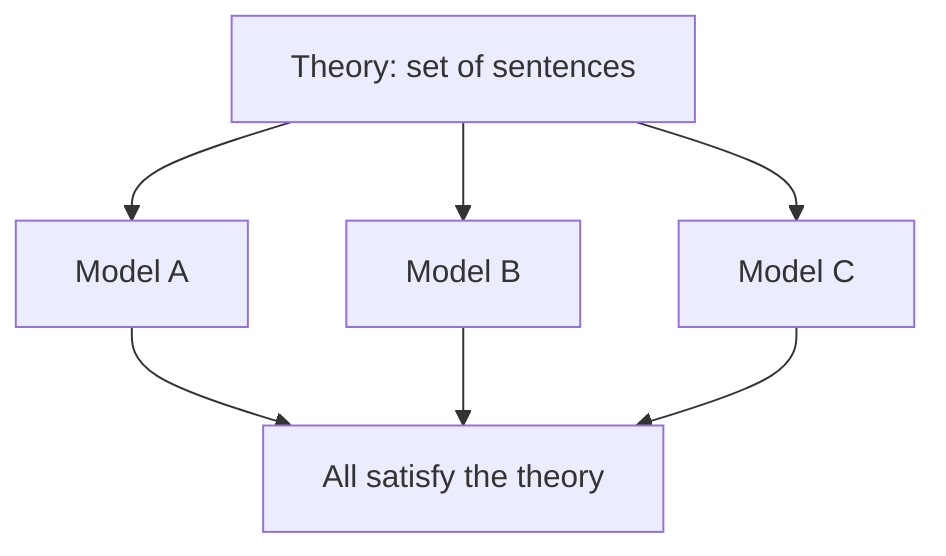
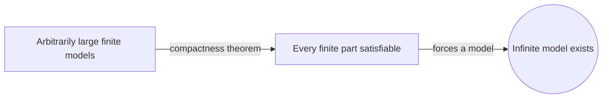
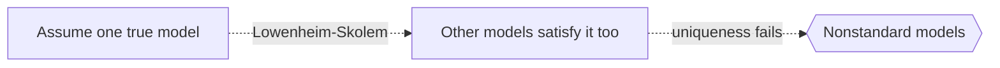

# Model Theory

## Overview

Model theory studies the meaning side of logic. A formal theory is a set of sentences in some language. A model is a concrete structure, like a set with operations, in which those sentences come out true. Model theory asks which structures satisfy a theory, how many there are, and how they relate. Where proof theory looks at derivations, model theory looks at interpretations. It is the semantics of formal systems made into a rich field of its own.

It matters because it connects abstract axioms to actual objects. One theory can have many different models, which shows what the axioms fail to pin down. Powerful tools like the compactness theorem and the Löwenheim-Skolem theorems reveal surprising facts, such as arithmetic having models of unexpected sizes. Model theory has deep links to algebra and geometry, letting logicians prove concrete mathematical results by studying the structures that satisfy a theory.

### Quick Takeaways

- A model is a structure that makes every sentence of a theory true
- One theory can have many non-isomorphic models
- Compactness and Löwenheim-Skolem are its foundational tools

## Definition

- **Structure** is a set together with functions, relations, and constants interpreting a language.
- **Model** is a structure in which every sentence of a given theory is true.
- **Satisfaction** is the relation between a structure and a formula it makes true.
- **Compactness theorem** says a theory has a model if every finite part does.
- **Elementary equivalence** means two structures satisfy exactly the same sentences.
- **Löwenheim-Skolem** results give models of controlled infinite sizes.

## The Analogy

Think of a blueprint and the buildings that match it. The blueprint lists requirements, like "three floors and two exits." Many different buildings can satisfy the same blueprint, differing in color, materials, and layout. Model theory studies the relationship between the blueprint, which is the theory, and the family of buildings that satisfy it, which are the models.

## When You See It

- Showing a set of axioms does not determine a structure uniquely
- Proving statements are independent by exhibiting different models
- Applying logic to algebra, such as fields and groups
- Explaining nonstandard models of arithmetic and analysis
- Using compactness to build infinite objects from finite constraints
- Classifying theories by how many models they have at each size

## Examples

**Good:** Using the compactness theorem to prove that if a set of first-order axioms has arbitrarily large finite models, it also has an infinite model. The finite pieces force an infinite structure.

**Bad:** Assuming that because a theory describes "the" natural numbers, it has only one model. First-order arithmetic actually has many nonstandard models.

## Important Points

- Model theory is the semantic counterpart to proof theory
- The compactness theorem is a central and surprising tool
- Löwenheim-Skolem shows first-order theories cannot fix infinite sizes
- A theory can be categorical at some cardinalities but not others
- Elementary equivalence can hold between structures that look different
- First-order logic cannot uniquely characterize the natural numbers
- Model theory has strong applications in algebra and geometry

## Summary

- Model theory studies structures that satisfy formal theories.
- One theory usually has many distinct models.
- Compactness and Löwenheim-Skolem are its signature theorems.
- It reveals the limits of what axioms can pin down.
- It links logic to concrete algebra and geometry.
- _The axioms are the words, and model theory studies every world they allow._
