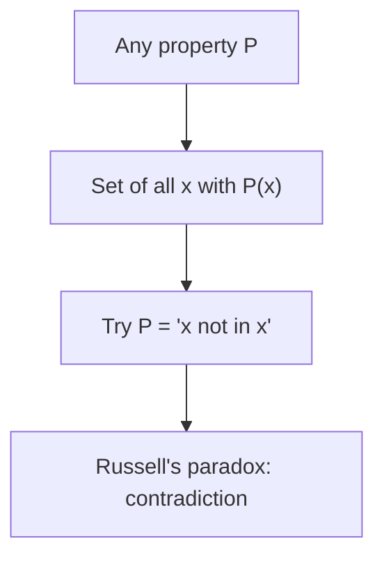

# Naive Set Theory

## Overview

Naive set theory treats sets in an informal, intuitive way. A set is just any collection of objects you can describe, and you form sets freely from any property. If you can state a condition, you assume there is a set of exactly the things meeting it. This is the version most people meet first, and it is enough for everyday mathematics like counting, unions, and intersections. Its rules feel natural because they match how we talk about groups of things.

The problem is that unrestricted set formation breaks. Around 1900 Russell found a fatal paradox by considering the set of all sets that do not contain themselves. Asking whether that set contains itself gives a contradiction either way. This showed naive set theory is inconsistent when pushed hard. The response was axiomatic set theory, which restricts how sets may be formed. Naive set theory survives as a useful teaching tool and a convenient shorthand, as long as you stay away from the dangerous cases.

### Quick Takeaways

- Sets are formed freely from any describable property
- It is intuitive and enough for most everyday mathematics
- Unrestricted formation leads to paradoxes like Russell's

## Definition

- **Set** is intuitively any collection of objects you can describe.
- **Unrestricted comprehension** is the rule that any property defines a set.
- **Membership** is the relation stating an object belongs to a set.
- **Russell's paradox** is the contradiction from the set of all non-self-membered sets.
- **Extensionality** is the principle that sets are equal when they have the same elements.
- **Universal set** is the informal idea of a set of everything, which causes trouble.

## The Analogy

Think of a librarian who promises to file a card for any rule you can state, including rules about cards. Ask for a card listing every card that does not list itself. If that card lists itself, it should not. If it does not, it should. The librarian is stuck. Naive set theory is that overpromising librarian, generous until a self-referential request breaks the whole system.

## When You See It

- Introductory courses teaching unions, intersections, and subsets
- Everyday informal reasoning about collections
- Quick shorthand where paradox cases never arise
- Explaining why axiomatic set theory became necessary
- Illustrating Russell's paradox to motivate restrictions
- Comparing intuitive and formal views of sets

## Examples

**Good:** Using naive set notation to describe the set of even numbers or the intersection of two finite sets. These ordinary cases never trigger a paradox.

**Bad:** Forming the universal set of all sets, or the set of all sets that do not contain themselves. These self-referential constructions collapse into contradiction.

## Important Points

- Naive set theory assumes unrestricted comprehension
- It matches everyday intuition about collections
- Russell's paradox proves it is inconsistent in general
- The paradox comes from self-reference and unrestricted formation
- Axiomatic set theory replaced it to restore consistency
- It remains a fine teaching and shorthand tool in safe cases
- Extensionality still holds and carries over to formal theories

## Summary

- Naive set theory forms sets freely from any property.
- It is intuitive and sufficient for ordinary mathematics.
- Unrestricted comprehension makes it inconsistent.
- Russell's paradox is the classic fatal example.
- Axiomatic set theory fixed the problem by restricting formation.
- _Its downfall was generosity: promising a set for every rule you could state._
