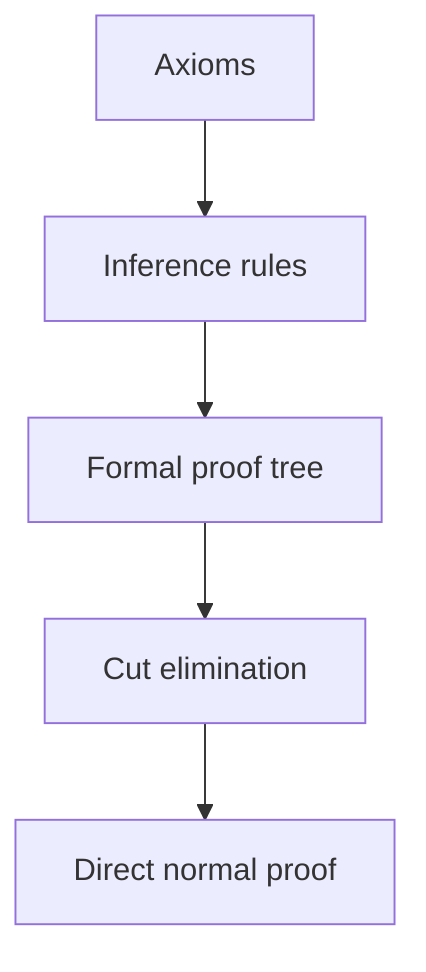
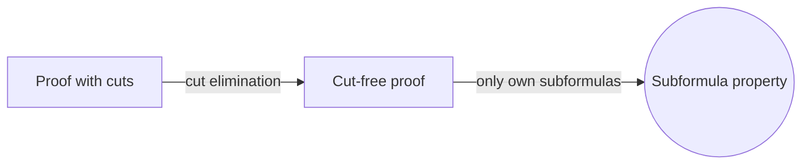
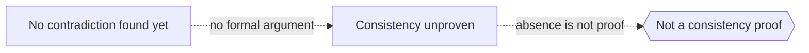

# Proof Theory

## Overview

Proof theory studies proofs as concrete mathematical objects. In everyday mathematics a proof is an argument that convinces a reader. In proof theory a proof is a finite structure of symbols built by fixed rules, like a tree of inferences. Because the proof itself is now an object, we can measure it, transform it, and prove theorems about the class of all proofs. This shifts attention from what is true to how truth is derived.

Proof theory matters because it reveals the hidden mechanics of derivation. Systems like natural deduction and the sequent calculus give clean rules for building proofs. A central result, cut elimination, shows that detours in a proof can be removed, leaving a direct form with strong properties. Proof theory also measures the strength of theories through ordinal analysis and grew from Hilbert's program to secure mathematics by finitary means. Gödel's theorems bounded that program but did not end the field.

### Quick Takeaways

- A proof is treated as a finite, rule-built object we can analyze
- Sequent calculus and natural deduction give formal proof structures
- Cut elimination removes detours, yielding direct proofs with clean properties

## Definition

- **Formal proof** is a finite sequence or tree of statements built by inference rules.
- **Sequent calculus** is a proof system organizing derivations around sequents of assumptions and conclusions.
- **Natural deduction** is a proof system mirroring intuitive introduction and elimination steps.
- **Cut rule** is a rule that uses a lemma, and cut elimination shows it can be removed.
- **Consistency proof** is a demonstration that a theory cannot derive a contradiction.
- **Ordinal analysis** is a method that measures a theory's strength by an ordinal number.

## The Analogy

Think of a recipe versus a finished dish. Model theory tastes the dish and asks if it is good. Proof theory studies the recipe, the exact ordered steps that produce it. You can rewrite a recipe to remove wasteful steps while keeping the same result. Cut elimination is exactly that: streamlining the recipe of a proof without changing what it cooks.

## When You See It

- Formal proof systems in logic courses and proof assistants
- Analyzing whether a theory is consistent by finitary means
- Studying the computational content hidden inside proofs
- Comparing the strength of two theories via ordinals
- Normalizing proofs to a canonical, detour-free form
- Connecting proofs to programs through the Curry-Howard idea

## Examples

**Good:** Using cut elimination in the sequent calculus to show a logic has the subformula property, so every provable statement has a direct proof using only its own parts.

**Bad:** Claiming a theory is consistent just because no contradiction has been found yet. Absence of a known contradiction is not a proof-theoretic consistency argument.

## Important Points

- Proofs become objects, so we can prove theorems about proving itself
- Cut elimination is the central technical engine of the field
- The subformula property follows from cut-free proofs
- Ordinal analysis assigns a strength measure to formal theories
- Hilbert's program aimed to secure math with finitary consistency proofs
- Gödel's second theorem limits self-proved consistency, not the whole field
- Curry-Howard links proofs to programs and formulas to types

## Summary

- Proof theory treats proofs as finite objects built by explicit rules.
- Sequent calculus and natural deduction give it clean formal systems.
- Cut elimination removes detours and yields direct, well-behaved proofs.
- Ordinal analysis measures how strong a theory really is.
- It carries Hilbert's program forward within Gödel's known limits.
- _It studies not whether a claim is true, but the exact path that reaches it._
