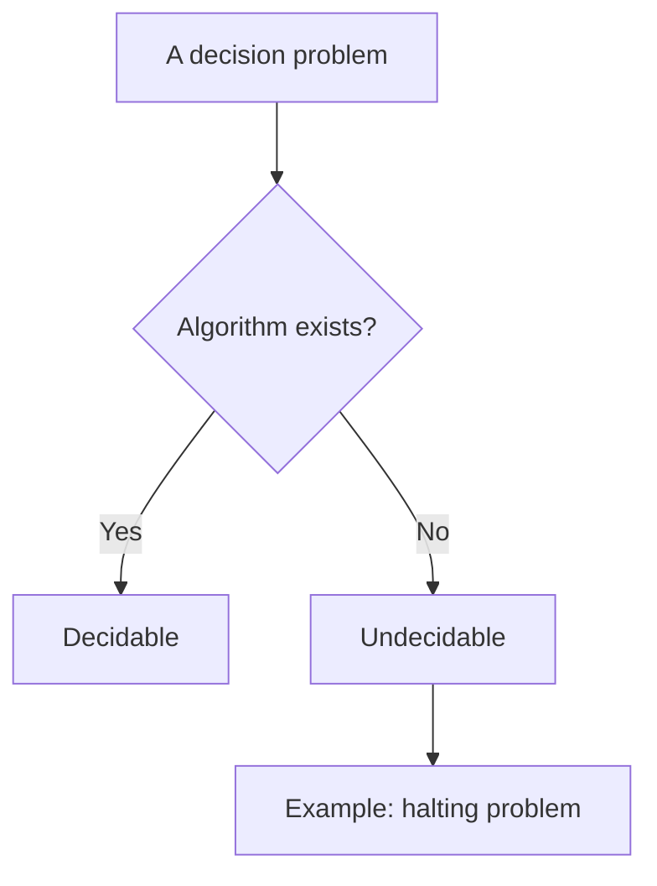
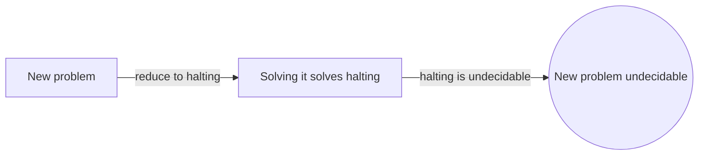
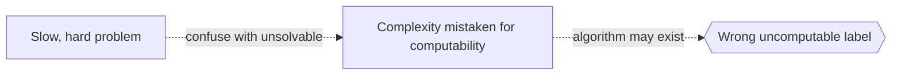

# Recursion Theory

## Overview

Recursion theory, also called computability theory, studies what a machine can compute in principle. It ignores speed and memory and asks a sharper question. Is there any mechanical procedure that solves a given problem at all? A function is computable if some finite procedure returns its value for every input. Many models capture this idea, including Turing machines and recursive functions, and they all define the same class. That agreement is strong evidence that the notion of "computable" is robust.

It matters because it draws the line between solvable and unsolvable. The famous halting problem shows some questions have no algorithm, no matter how clever. Recursion theory then ranks unsolvable problems by difficulty using reductions and degrees. This gives a whole hierarchy above the computable. The field ties directly to Gödel's incompleteness, since unprovability and uncomputability are two views of the same underlying limit.

### Quick Takeaways

- A function is computable if a finite mechanical procedure computes it
- Different models of computation define the same computable class
- Some problems, like the halting problem, have no algorithm at all

## Definition

- **Computable function** is a function whose values a finite procedure produces for all inputs.
- **Turing machine** is an abstract model that formalizes mechanical computation.
- **Church-Turing thesis** is the claim that computable equals what a Turing machine can do.
- **Decidable set** is a set with an algorithm that answers membership for every input.
- **Halting problem** is the undecidable question of whether a program stops on an input.
- **Turing degree** is a measure ranking problems by relative computational difficulty.

## The Analogy

Think of tasks you could give an infinitely patient clerk with unlimited paper but only a fixed rulebook. Some tasks, like adding two numbers, the clerk always finishes. Others, like deciding in advance whether a given instruction sheet ever tells the clerk to stop, cannot be settled by any rulebook. Recursion theory studies which tasks the tireless clerk can and cannot ever complete.

## When You See It

- Proving a problem has no possible algorithm
- Explaining the halting problem and its many corollaries
- Ranking undecidable problems by relative difficulty
- Connecting computability to Gödel's incompleteness
- Justifying why some compiler or verification tasks are impossible in general
- Defining the class of computable functions across models

## Examples

**Good:** Reducing a new problem to the halting problem to prove it is undecidable. If solving the new problem would solve halting, the new problem must also be unsolvable.

**Bad:** Assuming that a slow or hard problem is uncomputable. Difficulty in practice is about complexity, not about whether any algorithm exists at all.

## Important Points

- Computability ignores efficiency and asks only if a procedure exists
- Turing machines, recursive functions, and lambda calculus all agree
- The Church-Turing thesis identifies computable with mechanically computable
- The halting problem is the canonical undecidable problem
- Reductions transfer undecidability from one problem to another
- Turing degrees form a rich hierarchy above the computable
- Uncomputability and Gödel's unprovability are deeply linked

## Summary

- Recursion theory studies what is computable in principle, not in practice.
- Many models define the same robust class of computable functions.
- Some problems, like halting, have no algorithm at all.
- Reductions and degrees rank unsolvable problems by difficulty.
- It shares a common root with Gödel's incompleteness theorems.
- _It marks the edge of the computable, a border no cleverness can cross._
