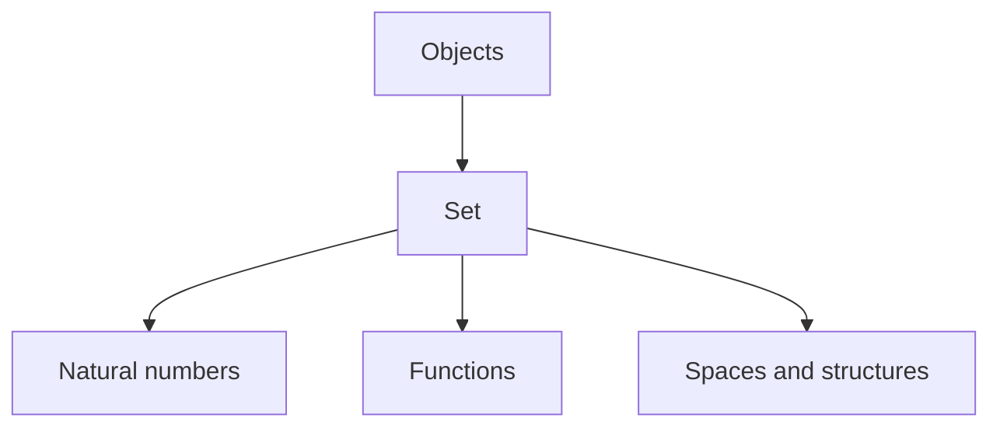
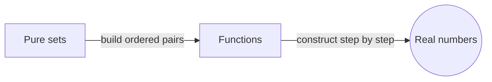
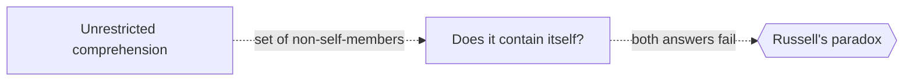

# Set Theory

## Overview

Set theory studies sets, which are collections of objects treated as a single whole. The idea sounds simple, yet it is powerful enough to define almost every other mathematical object. Numbers, functions, relations, and spaces can all be built from sets. Because of this reach, set theory serves as a shared language and a foundation. When mathematicians say a structure "is" a certain thing, they often mean it can be modeled as a specific set.

Set theory matters most for how it handles infinity. Cantor showed that infinite sets come in different sizes, and that the real numbers are strictly larger than the natural numbers. This opened a whole theory of cardinal and ordinal numbers. Early informal set theory hit paradoxes, so it was replaced by careful axiomatic versions like ZFC. The central tension is taming infinity and self-reference without letting contradictions back in.

### Quick Takeaways

- A set is a collection of objects treated as one whole
- Almost all mathematical objects can be built from sets
- Infinite sets have different sizes, discovered by Cantor

## Definition

- **Set** is a collection of distinct objects considered as a single entity.
- **Element** is an object that belongs to a set, written as membership.
- **Subset** is a set all of whose elements also belong to another set.
- **Cardinality** is a measure of the size of a set, finite or infinite.
- **Ordinal** is a number type describing position and order in well-ordered sets.
- **Power set** is the set of all subsets of a given set.

## The Analogy

Think of boxes that can hold objects, and can also hold other boxes. An empty box still exists and counts as something. From nothing but boxes you can build a rich hierarchy: a box holding an empty box, a box holding that, and so on. Numbers and structures emerge as patterns of nested boxes. Set theory is the study of these boxes and the rules for what they may contain.

## When You See It

- Defining numbers, functions, and relations from first principles
- Comparing the sizes of infinite collections
- Serving as the base language in most math textbooks
- Reasoning about power sets and hierarchies of infinity
- Discussing the axiom of choice and its consequences
- Building models to test independence of statements

## Examples

**Good:** Defining an ordered pair, a function, and then the real numbers step by step from sets. This shows set theory can express the objects of analysis.

**Bad:** Forming "the set of all sets that do not contain themselves." This unrestricted comprehension leads to Russell's paradox and must be avoided.

## Important Points

- Sets can serve as a universal language for mathematics
- Cantor proved infinities come in different sizes
- The power set of any set is strictly larger than the set
- Naive comprehension causes paradoxes and was abandoned
- ZFC is the standard axiomatic set theory today
- Ordinals and cardinals extend counting into the infinite
- The continuum hypothesis is independent of ZFC

## Summary

- Set theory studies collections and builds mathematics from them.
- It provides a common language for numbers, functions, and structures.
- Cantor showed infinite sets have genuinely different sizes.
- Naive versions failed, so axiomatic set theory took over.
- Its deepest questions concern infinity and independence.
- _From the humble idea of a collection, an entire universe of mathematics unfolds._
