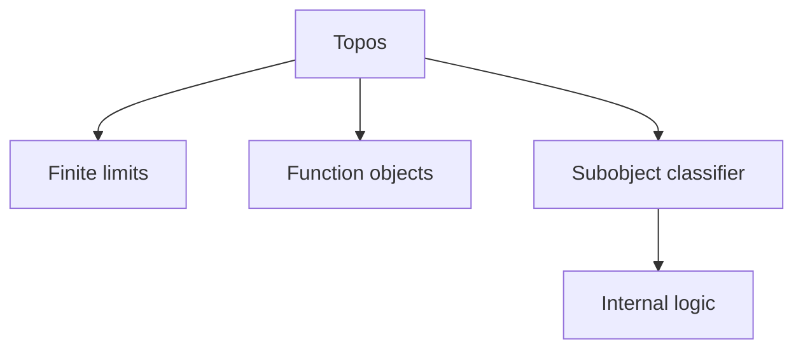
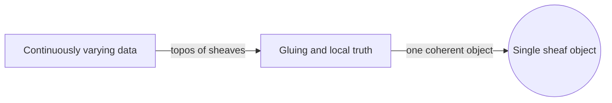
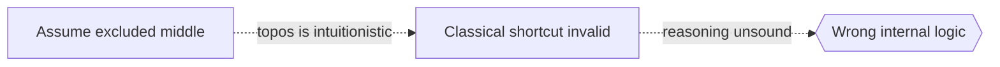

# Topos Theory

## Overview

Topos theory studies special categories that behave much like the category of sets. A topos has enough structure to do the constructions we take for granted with sets: forming products, function objects, and subobjects defined by properties. The key feature is a subobject classifier, an object that plays the role of truth values. In ordinary sets that object is just true and false. In a general topos it can be richer, which lets a topos carry its own internal logic.

It matters because a topos unifies geometry and logic in one frame. Grothendieck introduced toposes to generalize spaces in algebraic geometry, where a topos captures a notion of "space" through its sheaves. Lawvere and Tierney then showed toposes have a logical side and can serve as alternative foundations. Inside a general topos the logic is often intuitionistic, not classical, so the law of excluded middle need not hold. This makes topos theory a bridge between structure, space, and reasoning.

### Quick Takeaways

- A topos is a category that behaves like the category of sets
- Its subobject classifier acts as an internal object of truth values
- Each topos carries its own internal, often intuitionistic, logic

## Definition

- **Topos** is a category with finite limits, function objects, and a subobject classifier.
- **Subobject classifier** is an object representing truth values for subobjects.
- **Sheaf** is a structured assignment of data over a space that glues consistently.
- **Internal logic** is the logical system a topos supports for reasoning within it.
- **Grothendieck topos** is a topos of sheaves on a site, generalizing spaces.
- **Elementary topos** is a topos defined by purely categorical axioms.

## The Analogy

Think of different worlds each with their own idea of "true." In our familiar world a statement is simply true or false. In another world, truth might depend on where or when you stand, so "true" carries extra information. A topos is such a world, complete with its own logic of truth. Working inside a topos is like reasoning within that world's rules rather than our default ones.

## When You See It

- Generalizing spaces through sheaves in algebraic geometry
- Providing categorical foundations for mathematics
- Modeling intuitionistic and other nonclassical logics
- Reasoning about variable or context-dependent truth
- Connecting geometry and logic in one framework
- Building models where the excluded middle fails

## Examples

**Good:** Using the topos of sheaves on a space to treat continuously varying data as a single object. The topos structure handles gluing and local truth cleanly.

**Bad:** Assuming the law of excluded middle holds inside every topos. Most toposes are intuitionistic, so classical shortcuts can fail.

## Important Points

- A topos generalizes the category of sets
- The subobject classifier encodes truth values internally
- Grothendieck toposes come from sheaves on a site
- Elementary toposes are defined by categorical axioms alone
- Internal logic is typically intuitionistic, not classical
- Toposes bridge geometry and logic
- They can serve as an alternative foundation for mathematics

## Summary

- Topos theory studies categories that act like the category of sets.
- A subobject classifier gives each topos its own truth values.
- Grothendieck used toposes to generalize geometric spaces.
- Each topos carries an internal, often intuitionistic, logic.
- It unifies geometry, logic, and foundations in one setting.
- _Each topos is a little world, with its own sense of what counts as true._
