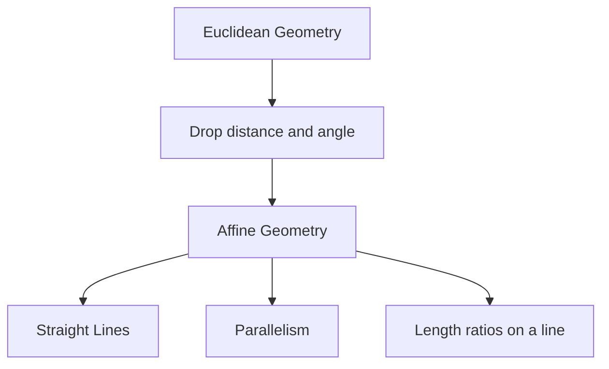
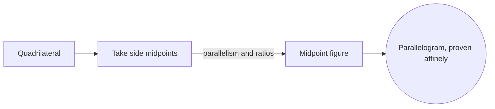

# Affine Geometry

## Overview

Affine geometry studies the properties of shapes that survive stretching, shearing, and skewing, as long as lines stay straight and parallels stay parallel. It sits below Euclidean geometry because it deliberately forgets things Euclid keeps. There is no fixed notion of distance or angle in affine geometry. What remains is which points lie on a line, whether lines are parallel, and the ratio of lengths measured along a single line.

The reason to strip away distance and angle is to isolate exactly what depends on them and what does not. Many facts, like the midpoint of a segment or lines being parallel, hold regardless of any metric. Affine geometry captures precisely those facts. The tension is that it feels weaker, yet that weakness is its strength: results proven affinely are more general and apply after any affine transformation.

### Quick Takeaways

- Affine geometry keeps straight lines, parallelism, and length ratios on a line
- It discards absolute distance and angle
- Facts proven affinely survive stretching, shearing, and skewing

## Definition

- **Affine space** is a set of points with parallel structure but no fixed origin.
- **Affine transformation** maps lines to lines and preserves parallelism.
- **Parallelism** is the relation of lines that never meet, which affine geometry keeps.
- **Ratio** along a line is the proportion of two segment lengths, preserved affinely.
- **Collinearity** is whether points lie on a common straight line.
- **Barycentric coordinates** locate a point as a weighted average of others.

## The Analogy

Imagine looking at a rectangular grid drawn on rubber, then stretching and shearing the sheet. Right angles vanish and lengths change, but straight lines stay straight and parallel lines stay parallel. Midpoints stay midpoints. Affine geometry is the study of exactly those features that the rubber stretch cannot destroy.

## When You See It

- Computer graphics transformations like scaling and shearing
- Linear algebra where affine maps combine a linear part and a shift
- Image warping that preserves parallel structure
- Physics using reference frames without a preferred origin
- Robotics and CAD applying affine coordinate changes
- Proving geometric facts that do not depend on measurement

## Examples

**Good:** Proving the midpoints of a quadrilateral sides form a parallelogram. The claim uses only parallelism and ratios, which are affine facts.

**Bad:** Trying to define a right angle or compute a distance purely in affine terms. Angle and distance are metric ideas that affine geometry does not have.

## Important Points

- Affine geometry is Euclidean geometry minus distance and angle
- Affine transformations preserve collinearity and ratios along lines
- Every affine map is a linear map followed by a translation
- Parallelism is preserved, but perpendicularity is not defined
- Barycentric and affine coordinates describe points without a metric
- It generalizes to affine spaces over any field, not just the reals
- Adding a distance rule to affine geometry recovers Euclidean geometry

## Summary

- Affine geometry keeps straightness, parallelism, and length ratios on a line.
- It discards any fixed notion of distance or angle.
- Affine transformations are linear maps plus a translation.
- Results proven affinely survive any stretch, shear, or skew.
- Adding a metric back to affine geometry gives Euclidean geometry.
- _It isolates the truths of shape that need no ruler or protractor._
