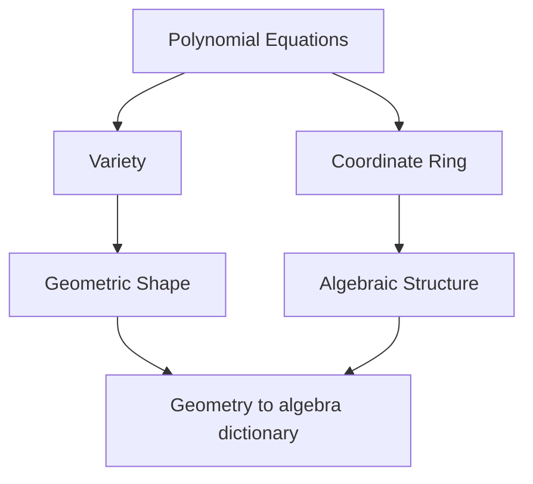

# Algebraic Geometry

## Overview

Algebraic geometry studies the shapes carved out by polynomial equations. The solution set of one or more polynomials is called a variety, and these varieties are the central objects. A single equation like x squared plus y squared minus one defines a circle, and more equations in more variables define curves, surfaces, and higher-dimensional shapes. The field translates back and forth between the geometry of these shapes and the algebra of the equations and their rings.

This subject matters because it unifies two of the deepest parts of mathematics and reaches into number theory, physics, and cryptography. The tension is between concrete pictures and heavy abstraction. Modern algebraic geometry, reshaped by Grothendieck with schemes, is famously abstract, yet it delivered spectacular results, including the proof of Fermat Last Theorem. Elliptic curves from this field also power much of modern public-key cryptography.

### Quick Takeaways

- Varieties are the solution sets of polynomial equations
- The field pairs geometry of shapes with algebra of equations
- It reaches into number theory, physics, and cryptography

## Definition

- **Variety** is the set of common zeros of a collection of polynomials.
- **Polynomial** is a sum of terms with variables raised to whole-number powers.
- **Ideal** is a set of polynomials closed under addition and multiplication by others.
- **Coordinate ring** is the algebra of functions on a variety.
- **Scheme** is a modern generalization of a variety allowing richer structure.
- **Elliptic curve** is a smooth cubic curve with a group structure on its points.

## The Analogy

Think of a shape and its equation as two languages describing the same object. A circle is a picture you can draw, and x squared plus y squared equals one is a sentence in algebra. Algebraic geometry is the dictionary translating perfectly between the pictures and the sentences, so a fact in one language reveals a fact in the other.

## When You See It

- Number theory and the proof of Fermat Last Theorem
- Elliptic-curve cryptography securing communications
- String theory and geometric models in physics
- Robotics solving systems of polynomial constraints
- Coding theory built from algebraic curves
- Computer algebra systems manipulating equations

## Examples

**Good:** Using elliptic curves over finite fields to build a compact, secure public-key system. Their group structure gives strong security with small keys.

**Bad:** Expecting a smooth-surface theorem to apply at a sharp cusp of a curve. Singular points violate the smoothness the theorem assumes.

## Important Points

- A variety is the geometric shape of a polynomial system solutions
- Hilbert Nullstellensatz links varieties to ideals of polynomials
- Grothendieck schemes generalized varieties and reshaped the field
- Singular points, like cusps, need separate careful treatment
- Elliptic curves carry a group law central to cryptography
- The field connects deeply to number theory and topology
- Computations use Grobner bases and computer algebra

## Summary

- Algebraic geometry studies shapes defined by polynomial equations.
- Varieties are the solution sets, its central objects.
- A dictionary links the geometry of shapes to the algebra of equations.
- Schemes give the modern, highly general foundation.
- It drives number theory, cryptography, and mathematical physics.
- _It reads a shape and its equations as two names for one truth._
