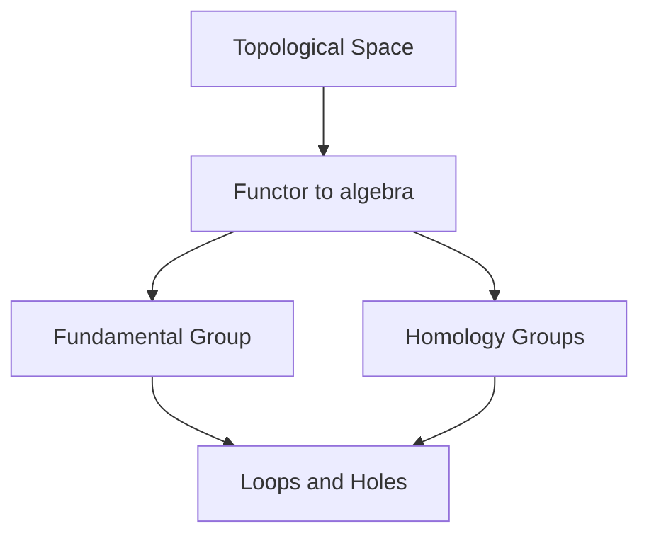

# Algebraic Topology

## Overview

Algebraic topology attaches algebraic objects, usually groups, to topological spaces in a way that respects continuous maps. The point is to convert hard geometric questions into algebra you can actually compute. If two spaces get different groups, they cannot be continuously deformed into each other, so the algebra proves they are genuinely different shapes. Holes of various dimensions are the intuition behind most of these invariants.

The field matters because deciding whether two spaces are the same is generally very hard, and algebraic invariants give computable tools to tell them apart. The fundamental group tracks loops, while homology and cohomology count holes in every dimension. The tension is that these invariants are strong but not perfect. Two spaces can share all the usual invariants yet still differ, so the algebra gives necessary conditions rather than a complete answer.

### Quick Takeaways

- Algebraic topology assigns groups to spaces respecting continuous maps
- Different invariants prove two spaces are not deformable into each other
- The fundamental group and homology detect holes in various dimensions

## Definition

- **Invariant** is an algebraic object unchanged by continuous deformation.
- **Fundamental group** records loops up to continuous shrinking.
- **Homology** measures holes of each dimension as groups.
- **Cohomology** is a dual construction with a richer algebraic product.
- **Homotopy** is a continuous deformation between two maps.
- **Functor** is the rule sending spaces and maps to algebra consistently.

## The Analogy

Imagine trying to prove two knotted ropes are truly different without untying them. If you compute a number from each rope in a way that never changes when you wiggle the rope, and the two numbers differ, the ropes must be different. Algebraic topology computes such wiggle-proof numbers and groups for whole spaces.

## When You See It

- Proving spaces are not homeomorphic via differing invariants
- Fixed-point theorems used in economics and analysis
- Topological data analysis extracting holes from data
- Physics classifying topological states and defects
- Distinguishing surfaces and higher-dimensional manifolds
- Studying vector fields and obstructions on spaces

## Examples

**Good:** Using the fundamental group to show a circle and a disk are different spaces. The circle has nontrivial loops while the disk has none.

**Bad:** Concluding two spaces are identical just because their homology matches. Equal invariants are necessary but not sufficient for equivalence.

## Important Points

- Invariants are functors respecting spaces and continuous maps together
- The fundamental group records loops up to deformation
- Homology counts holes in each dimension as abelian groups
- Cohomology adds a product giving extra algebraic structure
- Homotopy equivalence is coarser than homeomorphism
- Equal invariants are necessary but not sufficient for sameness
- Brouwer fixed-point theorem is a classic application

## Summary

- Algebraic topology maps spaces to algebraic invariants.
- Differing invariants prove two spaces are not equivalent.
- The fundamental group and homology detect holes.
- Cohomology adds extra product structure to the picture.
- Invariants give necessary but not always sufficient tests.
- _It turns the question of shape into computable algebra._
