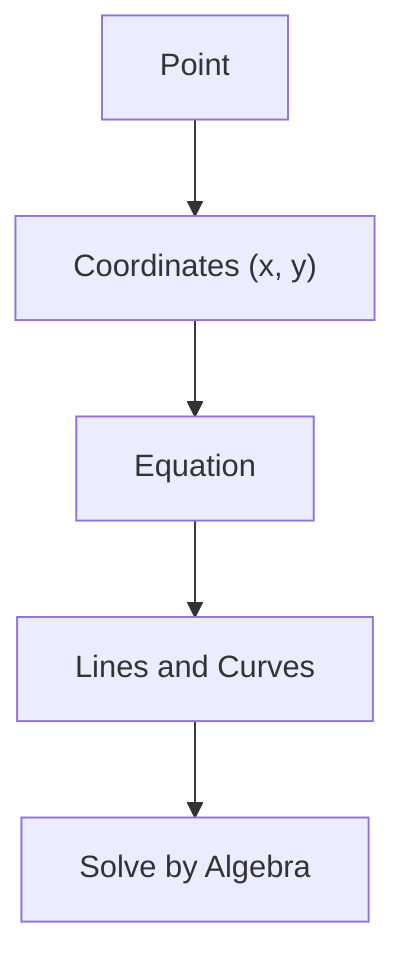
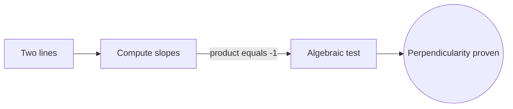

# Analytic Geometry

## Overview

Analytic geometry describes geometric objects using numbers and equations instead of pure diagrams. The central move is assigning coordinates to every point, so a point in the plane becomes a pair of numbers and a point in space becomes a triple. Once points are numbers, lines, circles, and curves become equations. A line is a linear equation, a circle is a quadratic one, and geometric questions turn into algebra you can solve step by step.

This fusion of algebra and geometry, introduced by Descartes and Fermat, is one of the most powerful ideas in mathematics. It lets you prove geometric facts by calculation and lets you picture algebraic equations as shapes. The tension is that coordinates depend on a chosen frame, so the same shape has different equations in different coordinate systems. Good analytic geometry picks coordinates that make the problem simple.

### Quick Takeaways

- Points become number tuples and shapes become equations
- Geometry problems turn into algebra you can solve mechanically
- The choice of coordinate frame changes the equations, not the shape

## Definition

- **Coordinate** is a number locating a point along one axis.
- **Axis** is a reference line for measuring one coordinate direction.
- **Origin** is the point where all coordinates are zero.
- **Equation of a curve** is a relation the coordinates of its points satisfy.
- **Slope** is the steepness of a line, its rise over run.
- **Distance formula** computes length between points from their coordinates.

## The Analogy

Think of a spreadsheet grid where every cell has a row and column number. Any location is named by two numbers, and you can compute relationships between cells with formulas. Analytic geometry does the same for space: every point gets a number address, and shapes become formulas you can calculate with directly.

## When You See It

- Plotting functions and data on graphs
- Computer graphics positioning points and curves
- Physics describing trajectories as equations
- GPS and mapping using coordinate systems
- Machine learning representing data as points in space
- Engineering CAD models built from coordinate geometry

## Examples

**Good:** Proving two lines are perpendicular by checking that the product of their slopes is negative one. The geometry reduces to a clean algebraic test.

**Bad:** Choosing an awkward tilted coordinate frame for a simple circle, leaving messy cross terms in the equation. A centered frame would make it trivial.

## Important Points

- Descartes and Fermat founded the field in the 17th century
- A point in the plane is an ordered pair, in space an ordered triple
- Lines are linear equations, conic sections are quadratic equations
- The distance formula comes straight from the Pythagorean theorem
- Changing coordinates can simplify or complicate the same problem
- It is the bridge that makes calculus of curves possible
- Vectors extend the idea to directions and higher dimensions

## Summary

- Analytic geometry represents points as numbers and shapes as equations.
- It converts geometric questions into solvable algebra.
- Descartes and Fermat united algebra and geometry this way.
- The equations depend on the chosen coordinate frame.
- It underpins graphing, calculus, graphics, and data science.
- _It gives every point an address so geometry can be computed, not just drawn._
