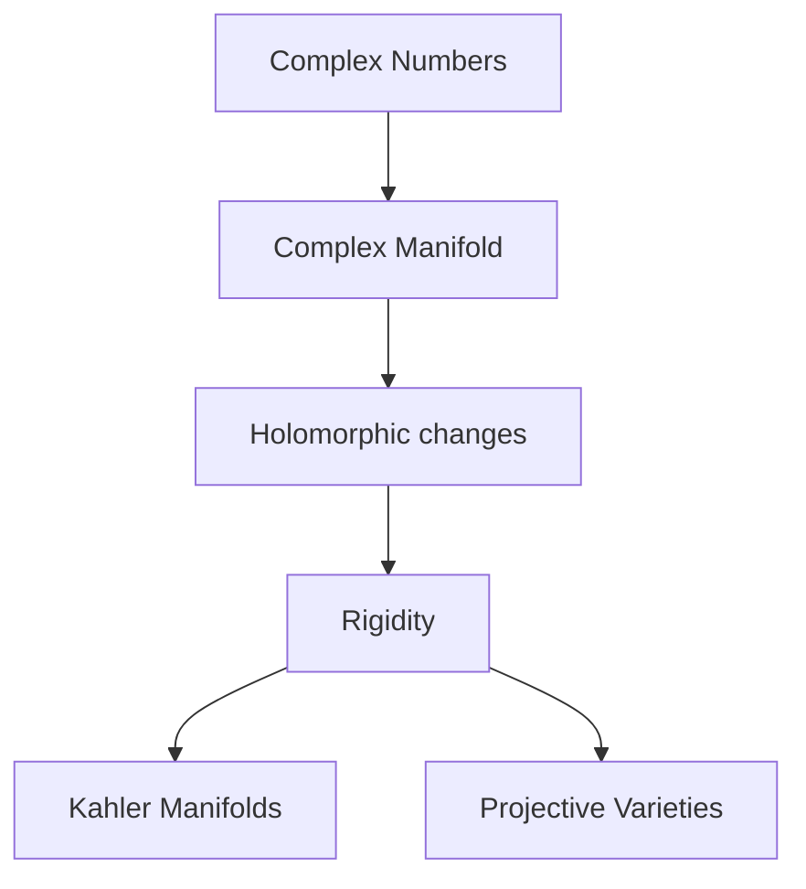

# Complex Geometry

## Overview

Complex geometry studies shapes built from complex numbers rather than real ones. A complex manifold looks locally like complex coordinate space, and its coordinate changes are not just smooth but holomorphic, meaning complex-differentiable. That extra requirement is far stronger than ordinary smoothness, and it forces the geometry to be remarkably rigid. Complex curves and surfaces, Kahler manifolds, and projective varieties all live here.

The field matters because complex structure ties together several deep areas: differential geometry, algebraic geometry, and topology all meet in it. Holomorphic functions are so constrained that knowing a little about them often determines a great deal, which makes complex-geometric objects easier to classify than real ones. The tension is that this rigidity cuts both ways. Many real shapes admit no compatible complex structure at all, so complex geometry describes a special, well-behaved world.

### Quick Takeaways

- Complex geometry studies manifolds modeled on complex numbers
- Holomorphic coordinate changes make the geometry very rigid
- It links differential, algebraic, and topological geometry

## Definition

- **Complex manifold** is a space locally modeled on complex coordinate space.
- **Holomorphic function** is a function that is complex-differentiable.
- **Complex structure** is the rule making tangent spaces behave like complex vector spaces.
- **Kahler manifold** is a complex manifold with a compatible, well-behaved metric.
- **Riemann surface** is a one-dimensional complex manifold.
- **Projective variety** is a complex shape defined by polynomial equations.

## The Analogy

Think of upgrading from a number line to the full complex plane at every point of a shape. Functions on it must respect the complex plane rotation and scaling, not just its stretch. That single extra rule is like requiring every local map to preserve a compass as well as distances, and it locks the geometry into a far tighter, more predictable structure.

## When You See It

- Riemann surfaces in complex analysis
- Algebraic geometry over the complex numbers
- String theory using Calabi-Yau manifolds
- Kahler geometry blending complex and metric structure
- Hodge theory linking topology and analysis
- Moduli spaces classifying complex shapes

## Examples

**Good:** Studying a compact Riemann surface to classify it by genus, its number of holes. Complex structure makes this classification clean and complete.

**Bad:** Assuming any even-dimensional smooth manifold carries a complex structure. Many do not, so complex-geometric tools simply cannot be applied.

## Important Points

- Holomorphic maps are far more rigid than smooth maps
- A complex manifold has even real dimension by construction
- Kahler manifolds carry compatible complex and metric structures
- Riemann surfaces are classified cleanly by their genus
- Complex projective varieties connect to algebraic geometry
- Hodge theory links complex structure to topology
- Calabi-Yau manifolds are central to string theory

## Summary

- Complex geometry studies manifolds modeled on complex numbers.
- Holomorphic coordinate changes give it strong rigidity.
- Kahler manifolds combine complex and metric structure.
- It unites differential, algebraic, and topological geometry.
- Not every real shape admits a compatible complex structure.
- _Its extra complex rule makes geometry tighter, richer, and more rigid._
