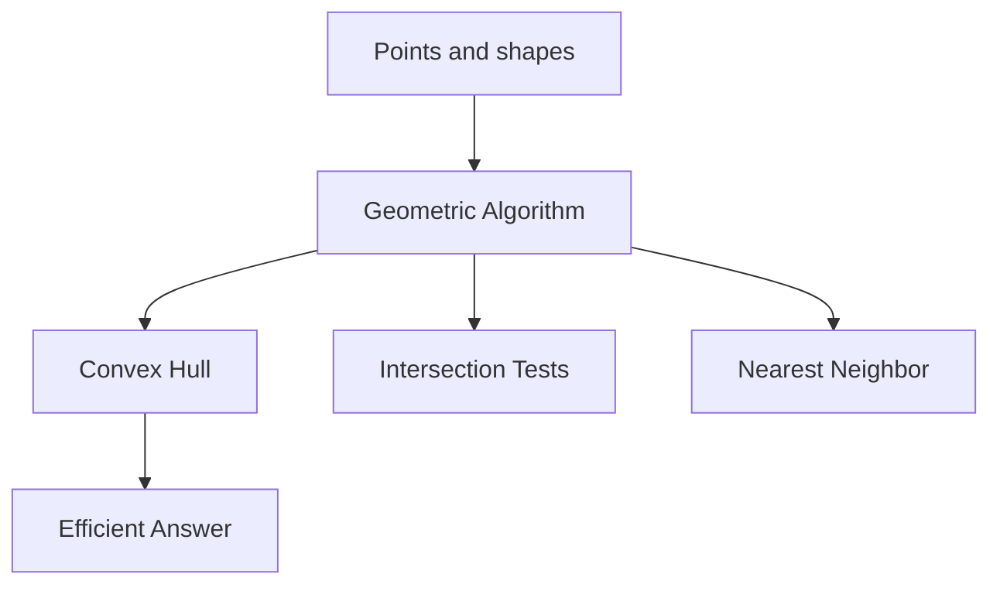
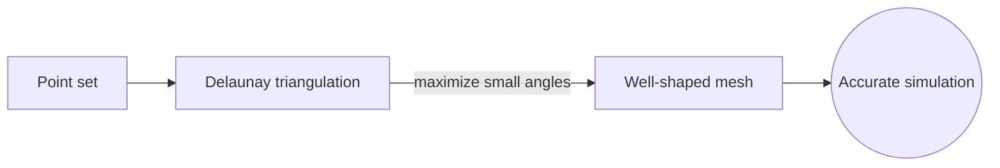
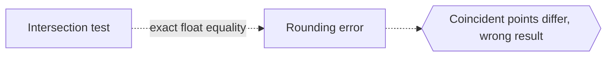

# Computational Geometry

## Overview

Computational geometry is the branch that designs algorithms for geometric problems. Instead of asking whether a geometric fact is true, it asks how to compute an answer quickly and correctly on a machine. Typical tasks include finding the convex hull of a point set, testing whether shapes intersect, locating the nearest neighbor of a point, or triangulating a region. The goal is efficiency, measured in how running time grows with the number of input objects.

This field matters because geometry appears everywhere in computing: graphics, robotics, geographic systems, and simulation all need fast geometric operations. The tension is between clean mathematical ideas and messy real data. Floating-point numbers cause tiny errors that break naive algorithms, and points can coincide or align in degenerate ways. Robust computational geometry must handle these cases without crashing or giving wrong answers.

### Quick Takeaways

- Computational geometry builds efficient algorithms for geometric problems
- It measures cost by how running time scales with input size
- Numerical precision and degenerate cases are constant challenges

## Definition

- **Convex hull** is the smallest convex shape enclosing a set of points.
- **Triangulation** breaks a region into non-overlapping triangles.
- **Voronoi diagram** partitions space by which site is nearest.
- **Delaunay triangulation** is the triangulation dual to a Voronoi diagram.
- **Sweep line** is an algorithm technique moving a line across the plane.
- **Degeneracy** is a special input case like collinear or coincident points.

## The Analogy

Imagine a delivery service that must instantly answer which warehouse is closest to any address in a city. Precomputing the regions closest to each warehouse turns every future query into a fast lookup. That precomputed map of nearest regions is a Voronoi diagram, and building it efficiently is a classic computational geometry task.

## When You See It

- Computer graphics and collision detection in games
- Geographic information systems answering spatial queries
- Robotics path planning around obstacles
- Nearest-neighbor search for recommendation and clustering
- CAD and mesh generation for simulation
- Motion planning and shape analysis

## Examples

**Good:** Building a Delaunay triangulation to generate a well-shaped mesh for a physics simulation. It avoids thin slivers that would ruin numerical accuracy.

**Bad:** Using exact-equality float comparisons in an intersection test. Rounding error makes points that should coincide differ, so the algorithm gives wrong results.

## Important Points

- Convex hulls can be computed in n log n time in the plane
- Sweep-line methods solve many intersection and closest-pair problems
- Voronoi diagrams and Delaunay triangulations are dual structures
- Running time is analyzed with big-O in the number of objects
- Floating-point error demands robust or exact arithmetic
- Degenerate inputs need explicit, careful handling
- Space partitioning trees speed up spatial queries

## Summary

- Computational geometry designs efficient algorithms for geometric tasks.
- It targets problems like hulls, intersections, and nearest neighbors.
- Cost is measured by how time scales with input size.
- Numerical precision and degenerate cases are key difficulties.
- It powers graphics, GIS, robotics, and simulation.
- _It turns geometric questions into fast, reliable computations._
