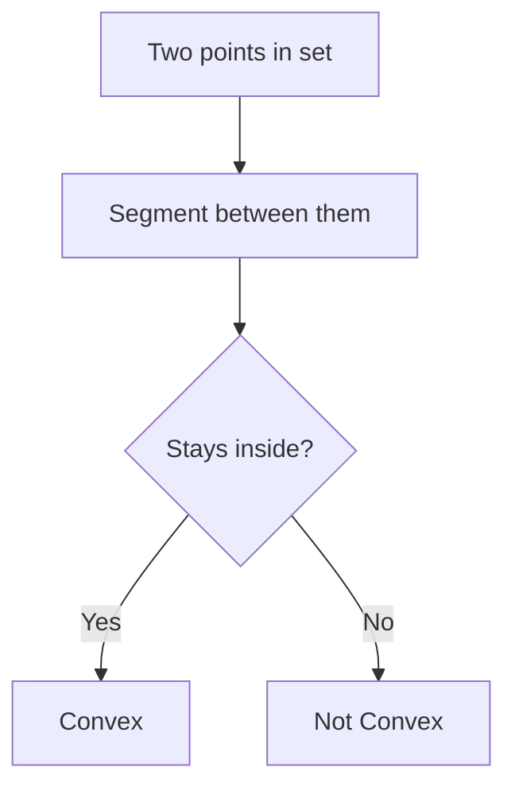
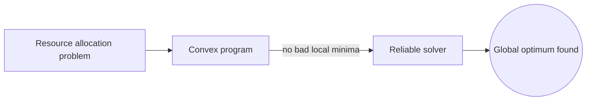
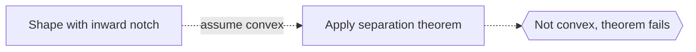

# Convex Geometry

## Overview

Convex geometry studies convex sets, which are shapes with a simple defining property: pick any two points inside, and the straight segment joining them stays entirely inside. Circles, disks, triangles, and cubes are convex, while a star or crescent is not. From that one rule flows a rich theory of polytopes, supporting lines, and separating planes that behaves far more predictably than geometry of arbitrary shapes.

Convexity matters because it is exactly the condition that makes optimization tractable. If a region and an objective are convex, then any local best is also the global best, so search never gets stuck. This is why convex geometry underpins linear programming, machine learning, and economics. The tension is that real problems are often nonconvex, so much of applied work is about approximating hard shapes with convex ones.

### Quick Takeaways

- A set is convex if the segment between any two of its points stays inside
- Convexity guarantees local optima are also global optima
- It is the backbone of tractable optimization

## Definition

- **Convex set** is a set containing the whole segment between any two of its points.
- **Convex hull** is the smallest convex set containing a given set of points.
- **Polytope** is a convex shape bounded by flat faces, like a polygon or polyhedron.
- **Supporting hyperplane** is a flat that touches a convex set without cutting through it.
- **Extreme point** is a corner that is not between any two other points of the set.
- **Separating hyperplane** is a flat that splits two disjoint convex sets apart.

## The Analogy

Stretch a rubber band around a scattered handful of nails on a board. The band snaps into the tightest loop containing all the nails, with no dents pointing inward. That taut outline is the convex hull, and any shape with no inward dents like it is convex. Convex geometry studies shapes with that no-dents property.

## When You See It

- Linear and convex programming in optimization
- Support vector machines separating data classes
- Computational geometry building convex hulls
- Economics modeling preferences and feasible sets
- Game theory and equilibrium arguments
- Collision detection using convex bounding shapes

## Examples

**Good:** Formulating a resource allocation problem as a convex program so the solver reliably finds the global optimum. Convexity removes the risk of bad local minima.

**Bad:** Assuming a shape with an inward notch is convex and applying separation theorems to it. The theorems require true convexity and fail on the notch.

## Important Points

- Any local minimum of a convex function over a convex set is global
- The convex hull is the tightest convex wrapper of a point set
- A separating hyperplane exists between any two disjoint convex sets
- Extreme points and vertices drive linear programming solutions
- Duality pairs a convex problem with a related dual problem
- High-dimensional convex bodies show surprising concentration effects
- Nonconvex problems are often relaxed to convex approximations

## Summary

- Convex geometry studies sets closed under taking inner segments.
- Convexity ensures local optima are also global optima.
- Convex hulls, supporting and separating hyperplanes are core tools.
- It powers optimization, machine learning, and economics.
- Nonconvex problems are often approximated by convex ones.
- _Convexity is the shape of problems that never trap you in a local trap._
