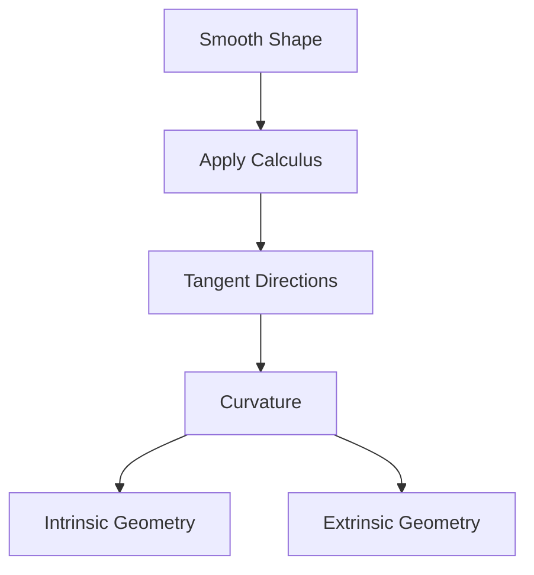
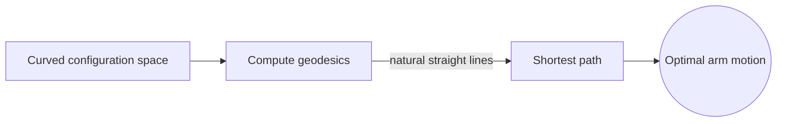
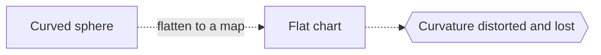

# Differential Geometry

## Overview

Differential geometry uses calculus to study smooth shapes like curves, surfaces, and higher-dimensional manifolds. Where classical geometry measures fixed lengths and angles, differential geometry measures how those quantities change from point to point. Its central concept is curvature, a precise number describing how sharply a shape bends. On a curve, curvature says how fast it turns. On a surface, it captures whether the surface is flat, dome-like, or saddle-shaped.

The field matters because smooth curved spaces are everywhere in physics and engineering. Einstein general relativity is written entirely in this language, treating gravity as the curvature of spacetime. The great insight, going back to Gauss, is that some curvature is intrinsic, meaning a creature living on a surface could detect it without ever leaving. The tension is separating intrinsic properties from those that only reflect how a shape sits in surrounding space.

### Quick Takeaways

- Differential geometry studies smooth shapes with calculus
- Curvature measures how sharply a shape bends
- Some curvature is intrinsic, detectable from within the surface

## Definition

- **Manifold** is a space that looks flat and Euclidean near each point.
- **Tangent space** is the flat space of directions at a single point.
- **Curvature** measures how much a shape deviates from being flat.
- **Geodesic** is the straightest possible path on a curved surface.
- **Metric** is a rule for measuring distances and angles on the shape.
- **Gaussian curvature** is an intrinsic bending measure of a surface.

## The Analogy

Imagine an ant crawling on the surface of a hilly landscape. It cannot see the third dimension, but by measuring how paths and triangles behave locally, it can still tell whether the ground beneath it is flat, domed, or saddle-shaped. Differential geometry is the ant mathematics, deducing bending from purely local measurements.

## When You See It

- General relativity describing gravity as spacetime curvature
- Computer graphics with smooth curved surfaces
- Robotics planning motion on curved configuration spaces
- Geodesy modeling the shape of the Earth
- Machine learning on curved data manifolds
- Engineering analysis of shells and membranes

## Examples

**Good:** Computing geodesics to find the shortest path a robot arm can follow on its curved configuration space. Geodesics are the natural straight lines there.

**Bad:** Assuming a flat map preserves the true curvature of a sphere. Any flat chart distorts a curved surface, so intrinsic curvature is lost.

## Important Points

- Curvature is the central quantity, describing how shapes bend
- Gauss Theorema Egregium shows Gaussian curvature is intrinsic
- Geodesics generalize straight lines to curved spaces
- A metric encodes all local distance and angle information
- Manifolds extend the ideas to any number of dimensions
- General relativity models gravity as spacetime curvature
- Intrinsic properties are detectable without leaving the surface

## Summary

- Differential geometry studies smooth shapes using calculus.
- Curvature measures how sharply a shape bends at each point.
- A metric encodes distances and angles across the shape.
- Some curvature is intrinsic, felt from within the surface.
- It is the mathematical language of general relativity.
- _It measures the bending of space from the inside out._
