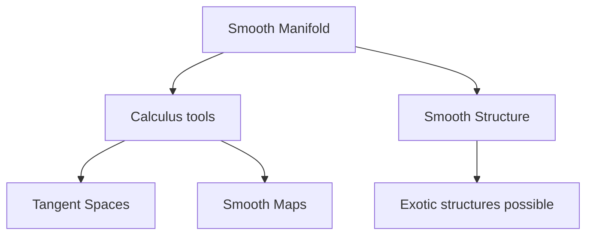
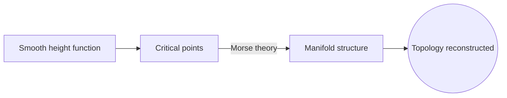
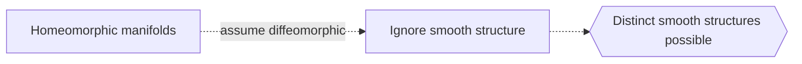

# Differential Topology

## Overview

Differential topology studies smooth manifolds, spaces on which calculus makes sense, and asks which properties survive smooth deformation. It sits between general topology and differential geometry. Unlike differential geometry, it does not fix a metric, so it ignores exact lengths and curvature. Unlike plain topology, it insists everything be smooth, so it can use derivatives, tangent spaces, and smooth maps as tools. The objects are the same manifolds, but the allowed deformations are smooth ones.

The field matters because smoothness is the right setting for much of physics and analysis, and smooth structure carries surprising information. A striking discovery is that a single topological space can carry genuinely different smooth structures, so being the same shape does not mean being the same smooth object. The tension is exactly this gap between topological sameness and smooth sameness, sharpest in dimension four, where exotic smooth structures famously appear.

### Quick Takeaways

- Differential topology studies smooth manifolds up to smooth deformation
- It uses calculus tools but fixes no metric or curvature
- Some spaces carry distinct smooth structures despite the same topology

## Definition

- **Smooth manifold** is a manifold with a consistent notion of differentiation.
- **Smooth map** is a function differentiable to all orders.
- **Diffeomorphism** is a smooth, reversible map with a smooth inverse.
- **Tangent bundle** collects the tangent spaces at all points.
- **Transversality** is a general-position condition for how submanifolds meet.
- **Exotic structure** is a smooth structure not diffeomorphic to the standard one.

## The Analogy

Imagine two roads that connect the same towns and can be bent into each other topologically, yet one has smooth curves and the other has sharp kinks that no smooth bending can remove. Differential topology is the study of when shapes match not just as bendable rubber but as genuinely smooth objects, kinks and all mattering.

## When You See It

- Foundations of smooth manifold theory in physics
- Morse theory linking functions to manifold shape
- Cobordism classifying manifolds by smooth boundaries
- Exotic spheres and four-dimensional smooth structures
- Vector fields and the hairy ball theorem
- Transversality arguments in geometry and analysis

## Examples

**Good:** Using Morse theory to reconstruct a manifold shape from a smooth height function critical points. The smooth structure encodes the topology cleanly.

**Bad:** Assuming two homeomorphic manifolds are automatically diffeomorphic. In dimension four especially, they can carry different smooth structures.

## Important Points

- The objects are smooth manifolds, deformed by smooth maps
- No metric is fixed, so lengths and curvature are ignored
- Diffeomorphism is the notion of smooth equivalence
- Morse theory connects smooth functions to manifold topology
- Transversality gives generic, well-behaved intersections
- Exotic smooth structures exist, notably in dimension four
- It sits between general topology and differential geometry

## Summary

- Differential topology studies smooth manifolds up to smooth maps.
- It uses calculus but fixes no metric or curvature.
- Diffeomorphism is its notion of sameness.
- Distinct smooth structures can share one topology.
- Dimension four is where exotic structures famously appear.
- _It asks when two shapes match smoothly, not merely as stretchy rubber._
