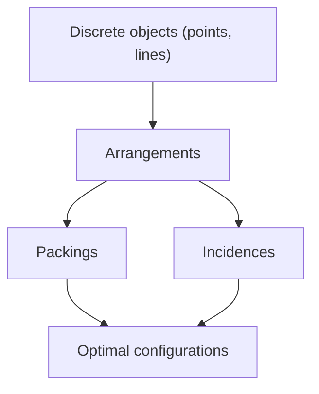

# Discrete Geometry

## Overview

Discrete geometry studies arrangements of separate geometric objects such as finite sets of points, lines, circles, and polygons. Instead of smooth curves and continuous motion, it counts and configures. Typical questions ask how many ways points can be placed, how tightly circles can pack, or how many lines a set of points can determine. The flavor is combinatorial, mixing counting arguments with geometric constraints.

This field matters because many real structures are inherently discrete: pixels, atoms in a crystal, cell towers, or data points. Understanding optimal packings and incidences answers practical questions about efficiency and coverage. The tension is that discrete problems often look simple but hide great difficulty. Sphere packing in three dimensions, for instance, stayed unproven for centuries despite an obvious-seeming answer.

### Quick Takeaways

- Discrete geometry studies finite or separated geometric configurations
- It blends combinatorics with geometric constraints
- Packing, incidence, and arrangement questions are central

## Definition

- **Discrete set** is a collection of separated points with gaps between them.
- **Packing** is an arrangement of shapes that do not overlap.
- **Covering** is an arrangement of shapes that leaves no gaps.
- **Incidence** counts how objects like points and lines touch.
- **Lattice** is a regular, repeating grid of points.
- **Configuration** is a specific finite arrangement of geometric objects.

## The Analogy

Think of arranging oranges in a crate to fit as many as possible. You cannot bend the oranges, and they cannot overlap, so the question is purely about placement. Finding the tightest arrangement is a packing problem, and reasoning about such finite, non-overlapping placements is the heart of discrete geometry.

## When You See It

- Sphere and circle packing for storage and coding
- Crystallography and lattice structures in materials
- Wireless coverage placing towers to cover an area
- Error-correcting codes based on point arrangements
- Computational geometry with finite point sets
- Art gallery problems about guarding a polygon

## Examples

**Good:** Using a hexagonal lattice to pack circles in the plane at the maximum possible density. The lattice gives the provably tightest arrangement.

**Bad:** Assuming a square grid packs circles as tightly as possible in the plane. The hexagonal arrangement is denser, so the square grid wastes space.

## Important Points

- Kepler conjecture on densest sphere packing was proven only recently
- Hexagonal packing is optimal for circles in the plane
- Incidence theorems bound how often points and lines can meet
- Lattices model crystals and underlie many error-correcting codes
- Helly and Radon theorems relate intersections of convex sets
- Many easily stated problems remain open or were extremely hard
- Results often connect to coding, cryptography, and optimization

## Summary

- Discrete geometry studies separated geometric objects and their arrangements.
- It combines combinatorial counting with geometric limits.
- Packing, covering, and incidence problems are central themes.
- Lattices connect it to crystals and error-correcting codes.
- Simple-sounding problems here are often surprisingly hard.
- _It asks how well separate shapes can fit, cover, and meet in space._
