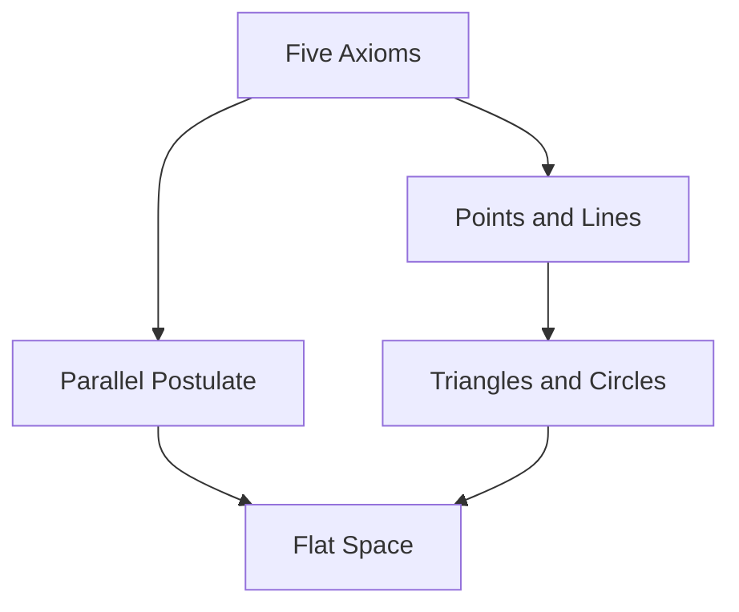
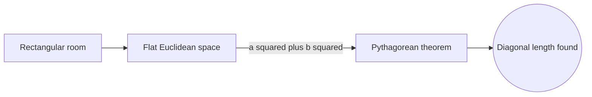
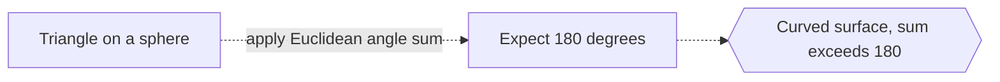

# Euclidean Geometry

## Overview

Euclidean geometry is the geometry of flat space, the kind you learn first in school. It is built from a small set of axioms written by Euclid around 300 BC, from which every theorem is proved by pure logic. Points, lines, and circles behave the way ordinary intuition expects. Parallel lines stay the same distance apart, and the angles of a triangle always add up to 180 degrees. Everything follows from the starting assumptions.

Its importance is twofold. Historically it was the first rigorous deductive system, a model for how mathematics should be organized. Practically it describes the flat world of drawings, floors, and short distances almost perfectly. The key tension is the fifth axiom about parallels. It seemed less obvious than the rest, and questioning it eventually opened the door to entirely new geometries.

### Quick Takeaways

- Euclidean geometry describes flat space using Euclid five axioms
- Parallel lines never meet and triangle angles sum to 180 degrees
- It is the historic template for rigorous, proof-based mathematics

## Definition

- **Axiom** is a starting assumption taken as true without proof.
- **Postulate** is Euclid word for a geometric axiom.
- **Parallel postulate** states that through a point off a line, exactly one parallel exists.
- **Congruence** means two shapes have identical size and form.
- **Similarity** means two shapes have the same form but possibly different size.
- **Plane** is the flat two-dimensional surface these rules describe.

## The Analogy

Think of a perfectly flat sheet of graph paper on a table. Every straight line you draw stays straight, parallel lines run side by side forever, and a triangle drawn anywhere has angles summing to a half turn. Euclidean geometry is simply the exact rulebook for that flat sheet, extended to any size.

## When You See It

- Basic school geometry with triangles, circles, and proofs
- Architecture and drafting on flat blueprints
- Everyday distance and area calculations over short ranges
- Computer screens and 2D graphics coordinate systems
- Carpentry and construction using right angles and levels
- Classical constructions with compass and straightedge

## Examples

**Good:** Using the Pythagorean theorem to find the diagonal of a rectangular room. Flat space is exactly where a squared plus b squared equals c squared holds.

**Bad:** Assuming triangle angles sum to 180 degrees on the surface of a sphere. On a curved surface that Euclidean fact simply fails.

## Important Points

- Euclid Elements deduced hundreds of theorems from just five postulates
- The parallel postulate is the one that distinguishes Euclidean from other geometries
- The Pythagorean theorem is a signature result of flat space
- Congruence and similarity classify shapes up to motion and scaling
- Compass-and-straightedge constructions define what is classically buildable
- Some tasks like trisecting an angle are provably impossible with those tools
- It is the geometry of zero curvature, a special flat case of broader theories

## Summary

- Euclidean geometry is the geometry of flat, uncurved space.
- It is built from Euclid five axioms and proved by strict logic.
- Parallel lines never meet and triangle angles sum to 180 degrees.
- It served as the historic model for rigorous mathematics.
- Questioning its parallel postulate led to non-Euclidean geometries.
- _It is the exact rulebook for the flat world our intuition already trusts._
