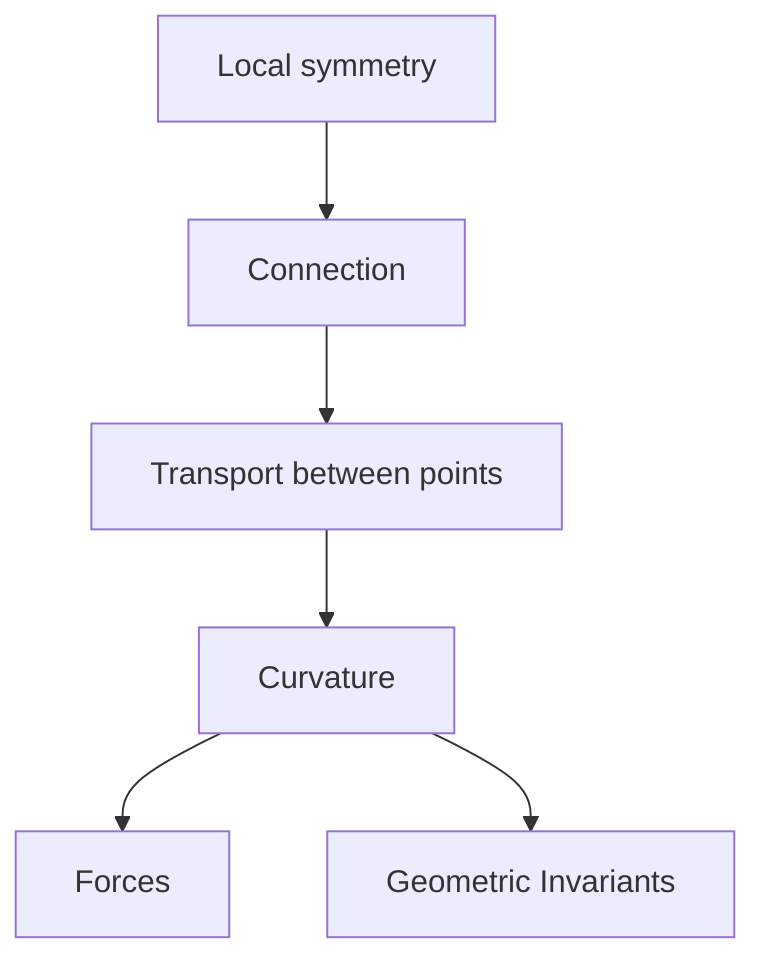

# Gauge Theory

## Overview

Gauge theory studies fields that carry a local symmetry, meaning you can transform the field differently at every point of space without changing the underlying physics. To compare the field at nearby points you need a connection, a rule for transporting values from one point to another. That connection and its curvature encode forces. In this precise sense the fundamental forces of nature, like electromagnetism, are described by gauge theories.

The subject sits at the crossroads of physics and geometry. Physicists use it as the framework for the Standard Model of particle physics. Mathematicians discovered that the same equations produce powerful invariants of shapes, especially four-dimensional ones. The tension is that gauge fields are not directly observable, only their curvature and certain loop quantities are. This gap between the field and what you can measure is both a subtlety and a source of rich structure.

### Quick Takeaways

- Gauge theory studies fields with a symmetry that varies point to point
- A connection compares the field across nearby points, its curvature gives forces
- It underlies particle physics and yields deep geometric invariants

## Definition

- **Gauge symmetry** is a symmetry that can act differently at each point of space.
- **Principal bundle** is the geometric stage where gauge fields live.
- **Connection** is a rule for comparing or transporting field values between points.
- **Curvature** measures the failure of transport around a loop to return unchanged.
- **Gauge field** is the field encoding the connection, like the electromagnetic potential.
- **Yang-Mills equations** are the field equations governing gauge theories.

## The Analogy

Imagine every point of space has its own tilted coordinate frame, and you can retilt each one freely. To compare a vector here with a vector there, you need instructions for carrying it across while accounting for the tilts. Those instructions are the connection, and how much a vector twists after a round trip is the curvature. Gauge theory studies exactly this bookkeeping of local frames.

## When You See It

- The Standard Model describing fundamental particle forces
- Electromagnetism as the simplest gauge theory
- Donaldson theory probing four-dimensional shapes
- Seiberg-Witten invariants in low-dimensional topology
- Condensed matter descriptions of emergent gauge fields
- Instantons and topological effects in quantum field theory

## Examples

**Good:** Using gauge-theory invariants to distinguish smooth structures on four-dimensional manifolds. The Yang-Mills equations reveal differences no classical tool detects.

**Bad:** Treating the gauge field itself as a directly measurable quantity. Only gauge-invariant data like curvature and loop holonomies are physical.

## Important Points

- Local symmetry forces the introduction of a connection to compare points
- Curvature of the connection encodes the physical force
- Yang-Mills equations are the central dynamical equations
- Electromagnetism is the abelian, simplest gauge theory
- The Standard Model is a gauge theory of the known forces
- Donaldson and Seiberg-Witten theory gave deep four-manifold invariants
- Only gauge-invariant quantities are physically meaningful

## Summary

- Gauge theory studies fields with symmetry that varies at each point.
- A connection lets you transport field values between points.
- Curvature of that connection encodes physical forces.
- It is the framework for the Standard Model of particle physics.
- Its equations also yield powerful invariants of four-manifolds.
- _It is the geometry of comparing local frames and the forces that gap creates._
