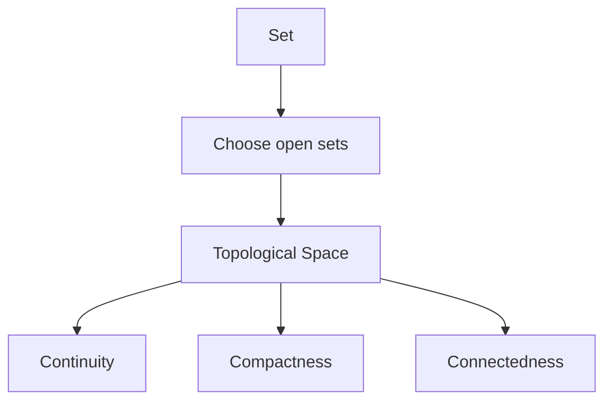

# General Topology

## Overview

General topology, also called point-set topology, is the foundation on which all of topology rests. It defines what a topological space is using the single primitive of open sets. A topology on a set is just a chosen collection of subsets called open, obeying a few simple rules, and from that spare data you can define nearness, limits, and continuity without ever mentioning distance. This makes it the most general framework for talking about closeness and convergence.

The field matters because it supplies the precise vocabulary that analysis and geometry rely on. Concepts like compactness and connectedness, defined here, control whether functions attain maxima and whether spaces come in one piece. The tension is that the definitions are abstract and can feel far from geometry. Yet that abstraction is deliberate, letting the same theorems apply to number lines, function spaces, and exotic spaces alike.

### Quick Takeaways

- General topology defines spaces using open sets alone
- It formalizes continuity, limits, and nearness without distance
- Compactness and connectedness are its central properties

## Definition

- **Topology** is a collection of open sets satisfying a few axioms.
- **Open set** is a basic set used to define nearness.
- **Closed set** is the complement of an open set.
- **Continuous map** is one whose preimages of open sets are open.
- **Compactness** means every open cover has a finite subcover.
- **Connectedness** means the space cannot be split into two separate open pieces.

## The Analogy

Think of describing a country not by exact distances but only by which regions overlap or border each other. From that neighbor information alone you can still say whether you can travel between two towns and whether a region is one contiguous piece. General topology is that neighbor-only description, using open sets in place of distances.

## When You See It

- Foundations of real analysis and calculus
- Defining convergence in function spaces
- Proving extreme-value results via compactness
- Establishing continuity in abstract settings
- Building blocks for algebraic and geometric topology
- Metric spaces treated as a special case

## Examples

**Good:** Using compactness to guarantee a continuous function on a closed bounded interval attains its maximum. The property follows directly from the topology.

**Bad:** Assuming every topological space behaves like ordinary distance space. Many spaces are not metric, so distance-based intuition can mislead.

## Important Points

- A topology is defined entirely by its chosen open sets
- Continuity is characterized by preimages of open sets being open
- Compactness generalizes closed and bounded, ensuring finiteness properties
- Connectedness captures being in a single piece
- Metric spaces are a special case with distance-induced topology
- Separation axioms grade how well points can be distinguished
- It provides the shared language for all other topology branches

## Summary

- General topology defines spaces through open sets alone.
- It formalizes continuity, limits, and nearness without distance.
- Compactness and connectedness are its key structural properties.
- Metric spaces are just one special case of the framework.
- It supplies the vocabulary analysis and geometry depend on.
- _It describes closeness using neighbors, never a ruler._
