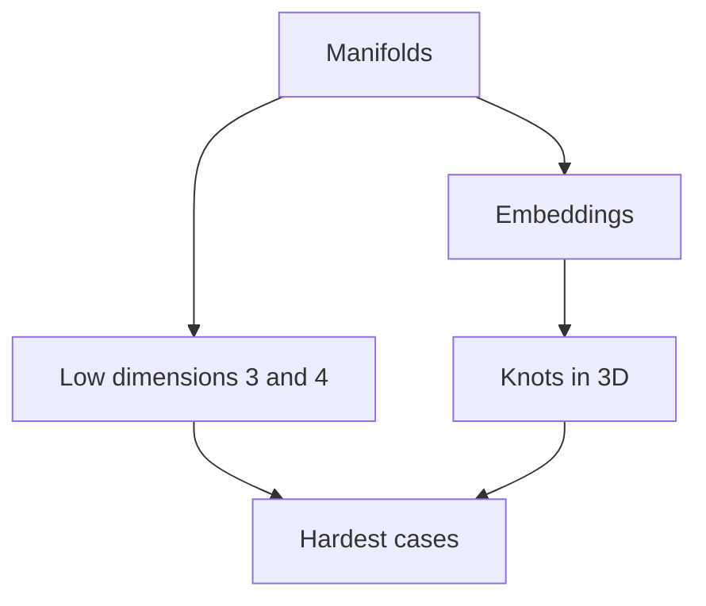
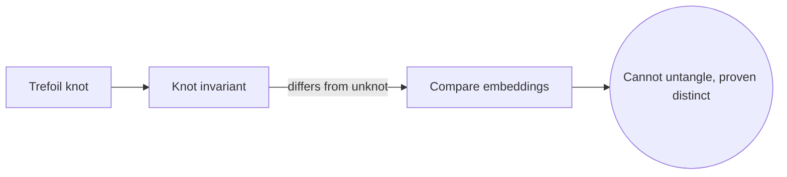
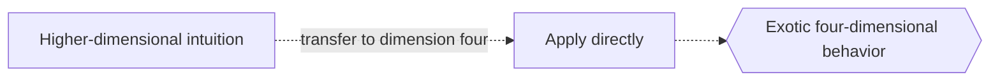

# Geometric Topology

## Overview

Geometric topology studies manifolds, which are spaces that look flat near each point, and the ways they can sit inside one another. Its most famous objects are knots, which are circles embedded in three-dimensional space, and surfaces and manifolds up to dimension four. Unlike algebraic topology, which computes invariants, geometric topology cares about the concrete shapes themselves and how they can be cut, glued, and deformed.

The field matters because low-dimensional spaces, the ones we can nearly picture, behave in strange and important ways. Dimensions three and four are notoriously the hardest, home to deep results like the Poincare conjecture and phenomena with no analogue in higher dimensions. The tension is that intuition built in dimensions one and two often fails in three and four, so geometric topology mixes visual reasoning with powerful machinery to handle cases that resist easy pictures.

### Quick Takeaways

- Geometric topology studies manifolds and how they embed
- Knots are circles embedded in three-dimensional space
- Dimensions three and four are uniquely subtle and hard

## Definition

- **Manifold** is a space that looks flat and Euclidean near each point.
- **Embedding** is a placement of one space inside another without self-crossing.
- **Knot** is a circle embedded in three-dimensional space.
- **Surface** is a two-dimensional manifold, like a sphere or torus.
- **Homeomorphism** is a continuous reversible map identifying two spaces.
- **Cobordism** relates manifolds that jointly bound a higher-dimensional one.

## The Analogy

Think about tying a shoelace and then gluing its ends into a loop. You can push and slide the loop around, but some knots can never be undone without cutting. Studying which tangled loops are genuinely different, and how shapes can be placed inside space, is exactly what geometric topology does.

## When You See It

- Knot theory and its invariants
- Classification of surfaces by genus
- The Poincare conjecture in three dimensions
- Exotic smooth structures in dimension four
- DNA topology and molecular knotting
- Three-manifold geometry and geometrization

## Examples

**Good:** Using a knot invariant to prove the trefoil knot cannot be untangled into a plain circle. The invariant distinguishes the two embeddings rigorously.

**Bad:** Assuming higher-dimensional intuition transfers directly to dimension four. Dimension four has exotic behavior that lower and higher dimensions lack.

## Important Points

- Manifolds and their embeddings are the central objects
- Knot theory studies embeddings of circles in three-space
- Surfaces are fully classified by genus and orientability
- The Poincare conjecture was resolved by Perelman using geometry
- Dimension four is uniquely hard, with exotic smooth structures
- Cobordism relates manifolds through what they jointly bound
- It blends visual reasoning with heavy technical machinery

## Summary

- Geometric topology studies manifolds and their embeddings.
- Knots are embedded circles it works to distinguish.
- Surfaces are classified cleanly by genus and orientability.
- Dimensions three and four are the subtlest and hardest.
- It mixes geometric intuition with powerful invariants.
- _It studies the concrete shapes of space and how they nest inside each other._
