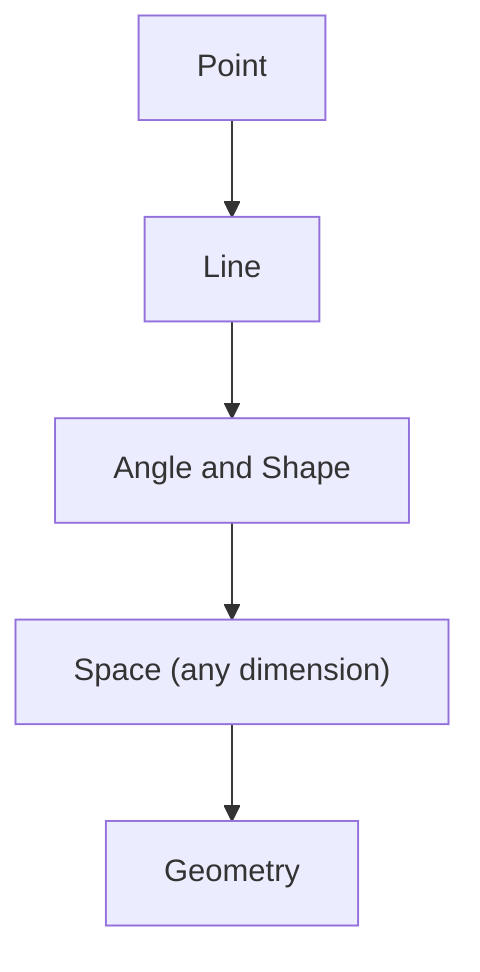
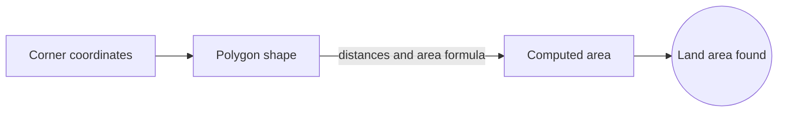
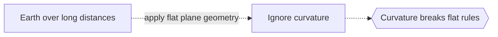

# Geometry

## Overview

Geometry is the branch of mathematics that studies space and the objects living in it. It starts from very simple ideas like points, lines, angles, and distance, then builds up rules for how these pieces relate. From those few primitives you can describe triangles, circles, solids, and eventually curved surfaces and spaces of any dimension. The core question is always the same: what stays fixed and what changes when we move, stretch, or reshape things.

Geometry matters because space is where most real problems live. Engineers, physicists, and artists all reason about position and shape. The tension in the subject is between what is intuitive and what is provable. Ancient geometers trusted diagrams, but modern geometry insists on axioms and proof, which is what lets it extend far past anything we can draw.

### Quick Takeaways

- Geometry studies shape, size, position, and the structure of space itself
- It builds from a few primitives like points and lines into rich theories
- Different geometries arise by choosing different axioms and notions of distance

## Definition

- **Point** is a location with no size, the most basic object.
- **Line** is a straight one-dimensional object extending without end.
- **Distance** is a rule measuring how far apart two points are.
- **Shape** is the form of an object independent of its position.
- **Transformation** is a way of moving or reshaping objects, like rotation.
- **Dimension** is the number of independent directions in a space.

## The Analogy

Think of geometry like the rules of a city map. Points are addresses, lines are streets, and distances tell you how far to travel. Once you agree on how to measure and move, you can describe any route, building, or district precisely. Change the rules of measurement, say on a globe instead of a flat map, and the geometry changes with it.

## When You See It

- Measuring land, buildings, and physical structures
- Computer graphics rendering shapes on a screen
- Physics describing the shape of spacetime
- Navigation and mapping on the curved Earth
- Design and architecture laying out forms and spaces
- Robotics planning motion through physical space

## Examples

**Good:** Using geometry to compute the area of a plot of land from its corner coordinates. The shapes and distances map directly onto the real problem.

**Bad:** Treating flat plane geometry as valid on the surface of the Earth over long distances. Curvature breaks the flat rules, so angles and distances come out wrong.

## Important Points

- Geometry rests on axioms, chosen starting assumptions that the rest follows from
- Euclid organized plane geometry into a deductive system around 300 BC
- Changing the parallel axiom yields non-Euclidean geometries
- Coordinates let algebra describe geometry, uniting the two fields
- Transformations reveal which properties are truly intrinsic to a shape
- Modern geometry studies spaces far beyond three dimensions
- Distance can be defined in many ways, giving many distinct geometries
- Symmetry is a central organizing idea across all geometries

## Summary

- Geometry studies shape, size, position, and the structure of space.
- It builds from primitives like points and lines through axioms and proof.
- Coordinates connect geometry to algebra and enable computation.
- Choosing different axioms or distances produces different geometries.
- The subject scales from flat drawings to curved, high-dimensional spaces.
- _Geometry is the discipline of asking what holds true when we move through space._
