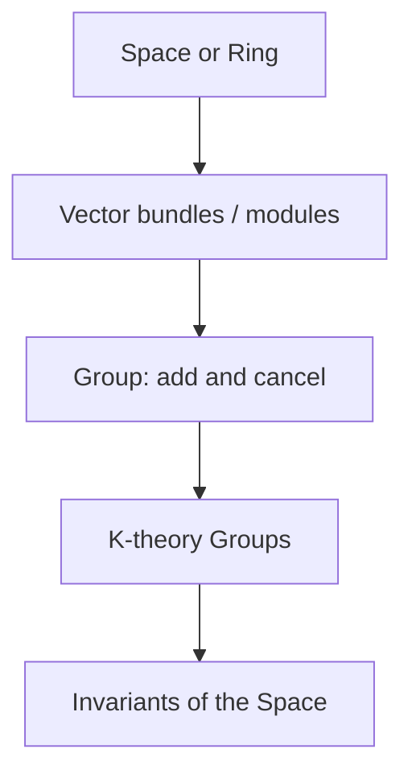

# K-Theory

## Overview

K-theory is a way of attaching algebraic invariants to a space or a ring by studying the bundles or modules that live over it. In topology it starts from vector bundles, which are families of vector spaces glued smoothly over a base space, like the tangent directions attached to every point of a surface. K-theory groups these bundles together, allowing them to add and cancel, and packages the result into groups that reveal deep features of the underlying space.

The field matters because it turns hard geometric or algebraic questions into computable group calculations. It provided the natural setting for the celebrated Atiyah-Singer index theorem, which links analysis, topology, and geometry. The tension is that K-theory is abstract and its objects, bundles and modules, feel far from ordinary shapes. Yet that abstraction is exactly what lets it detect structure that simpler invariants miss.

### Quick Takeaways

- K-theory builds invariants from vector bundles or projective modules
- It lets bundles add and cancel, forming algebraic groups
- It underlies the Atiyah-Singer index theorem

## Definition

- **Vector bundle** is a smooth family of vector spaces over a base space.
- **Projective module** is the algebraic analogue of a vector bundle over a ring.
- **Grothendieck group** turns a collection with addition into a group by allowing cancellation.
- **Topological K-theory** builds invariants from bundles over a topological space.
- **Algebraic K-theory** builds invariants from modules over a ring.
- **Index** is a number linking an operator analytic and topological data.

## The Analogy

Think of collecting different types of building blocks stacked over a floor plan. You can combine sets of blocks and, in K-theory, even subtract them as if they were numbers with a plus and minus. By treating whole families of blocks as things you can add and cancel, you distill the messy collection into a clean algebraic ledger describing the floor plan.

## When You See It

- Topology classifying vector bundles over a space
- The Atiyah-Singer index theorem in analysis and geometry
- Algebraic K-theory probing rings and number fields
- Physics classifying topological phases of matter
- Operator algebras and noncommutative geometry
- Invariants distinguishing spaces that look similar

## Examples

**Good:** Using topological K-theory to classify the possible vector bundles over a sphere. The K-theory group captures exactly which bundles can exist.

**Bad:** Expecting K-theory to recover every fine geometric detail of a space. It records bundle-level structure, not the full metric shape.

## Important Points

- The Grothendieck group construction lets bundles add and cancel
- Topological and algebraic K-theory share the same core idea
- K-theory groups are invariants preserved under suitable equivalences
- The Atiyah-Singer index theorem is a landmark K-theory application
- Bott periodicity gives topological K-theory a repeating structure
- It classifies topological phases in condensed matter physics
- Higher K-groups extend the theory into deep algebraic territory

## Summary

- K-theory attaches algebraic invariants to spaces and rings.
- It builds these from vector bundles or projective modules.
- The Grothendieck group lets bundles add and cancel like numbers.
- It provides the setting for the Atiyah-Singer index theorem.
- Its abstraction reveals structure simpler invariants miss.
- _It turns families of bundles into a ledger that fingerprints a space._
